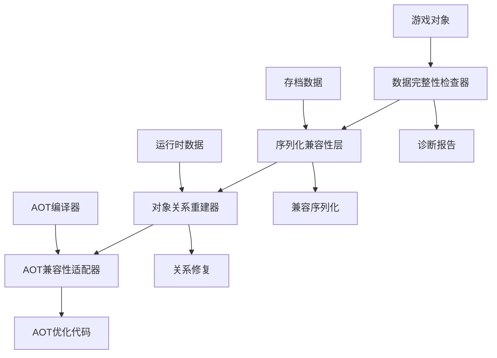

# AOT数据转换问题系统性修复设计文档

## 概述

本设计文档针对.NET AOT编译环境下的数据序列化/反序列化问题，提供系统性的技术解决方案。主要解决游戏对象属性在运行时变为null的问题，特别是`BelongedFaction.Leader`和`Person.IdealTendency`等关键对象关系。

### 问题根因分析

AOT编译限制了运行时反射和动态类型发现，导致：
1. **序列化失败**: 复杂对象图的序列化/反序列化在AOT环境下失效
2. **对象关系断裂**: 对象间的引用关系在反序列化后丢失
3. **延迟加载失效**: 依赖反射的延迟加载机制无法工作
4. **类型转换问题**: 动态类型转换在AOT环境下受限

## 架构设计

### 整体架构



### 核心组件

#### 1. 数据完整性检查器 (DataIntegrityChecker)
- **职责**: 检测和诊断数据转换问题
- **输入**: 游戏对象实例
- **输出**: 完整性报告和问题清单

#### 2. 序列化兼容性层 (SerializationCompatibilityLayer)
- **职责**: 提供AOT兼容的序列化方案
- **技术**: System.Text.Json源生成器
- **特性**: 支持多态序列化和自定义转换器

#### 3. 对象关系重建器 (ObjectRelationshipRebuilder)
- **职责**: 重建对象间的引用关系
- **策略**: 延迟加载和按需初始化
- **验证**: 关系一致性检查

#### 4. AOT兼容性适配器 (AOTCompatibilityAdapter)
- **职责**: 替换反射依赖的代码
- **方法**: 编译时代码生成
- **优化**: 启动时间和内存使用

## 组件和接口设计

### 数据完整性检查器

```csharp
public interface IDataIntegrityChecker
{
    Task<IntegrityReport> CheckAsync(GameObject gameObject);
    Task<IntegrityReport> CheckAllAsync();
    Task<bool> ValidateRelationshipsAsync(GameObject gameObject);
}

public class DataIntegrityChecker : IDataIntegrityChecker
{
    private readonly ILogger _logger;
    private readonly List<IIntegrityRule> _rules;
    
    public async Task<IntegrityReport> CheckAsync(GameObject gameObject)
    {
        var report = new IntegrityReport();
        
        foreach (var rule in _rules)
        {
            var result = await rule.ValidateAsync(gameObject);
            report.AddResult(result);
        }
        
        return report;
    }
}

public class IntegrityReport
{
    public List<IntegrityIssue> Issues { get; set; } = new();
    public DateTime CheckTime { get; set; }
    public int TotalObjectsChecked { get; set; }
    public int IssuesFound { get; set; }
}

public class IntegrityIssue
{
    public string ObjectType { get; set; }
    public int ObjectId { get; set; }
    public string PropertyName { get; set; }
    public string IssueType { get; set; } // "NullReference", "MissingRelation", "InvalidData"
    public string Description { get; set; }
    public string SuggestedFix { get; set; }
}
```

### 序列化兼容性层

```csharp
// AOT兼容的序列化上下文
[JsonSourceGenerationOptions(
    WriteIndented = true,
    PropertyNamingPolicy = JsonKnownNamingPolicy.CamelCase,
    GenerationMode = JsonSourceGenerationMode.Default)]
[JsonSerializable(typeof(Architecture))]
[JsonSerializable(typeof(Person))]
[JsonSerializable(typeof(Faction))]
[JsonSerializable(typeof(Troop))]
[JsonSerializable(typeof(Legion))]
public partial class GameObjectJsonContext : JsonSerializerContext
{
}

public interface ISerializationCompatibilityLayer
{
    Task<string> SerializeAsync<T>(T obj) where T : GameObject;
    Task<T> DeserializeAsync<T>(string json) where T : GameObject;
    Task<bool> ValidateSerializationAsync<T>(T obj) where T : GameObject;
}

public class SerializationCompatibilityLayer : ISerializationCompatibilityLayer
{
    private readonly JsonSerializerOptions _options;
    
    public SerializationCompatibilityLayer()
    {
        _options = new JsonSerializerOptions
        {
            TypeInfoResolver = GameObjectJsonContext.Default,
            Converters = 
            {
                new GameObjectReferenceConverter(),
                new FactionLeaderConverter(),
                new PersonIdealTendencyConverter()
            }
        };
    }
    
    public async Task<string> SerializeAsync<T>(T obj) where T : GameObject
    {
        try
        {
            return JsonSerializer.Serialize(obj, _options);
        }
        catch (Exception ex)
        {
            throw new SerializationException($"Failed to serialize {typeof(T).Name}: {ex.Message}", ex);
        }
    }
}
```

### 对象关系重建器

```csharp
public interface IObjectRelationshipRebuilder
{
    Task RebuildRelationshipsAsync(GameObject gameObject);
    Task<bool> ValidateRelationshipsAsync(GameObject gameObject);
    Task RepairBrokenRelationshipsAsync(GameObject gameObject);
}

public class ObjectRelationshipRebuilder : IObjectRelationshipRebuilder
{
    private readonly IGameObjectRepository _repository;
    private readonly ILogger _logger;
    
    public async Task RebuildRelationshipsAsync(GameObject gameObject)
    {
        switch (gameObject)
        {
            case Architecture arch:
                await RebuildArchitectureRelationshipsAsync(arch);
                break;
            case Person person:
                await RebuildPersonRelationshipsAsync(person);
                break;
            case Faction faction:
                await RebuildFactionRelationshipsAsync(faction);
                break;
        }
    }
    
    private async Task RebuildFactionRelationshipsAsync(Faction faction)
    {
        // 重建Leader关系
        if (faction.Leader == null && faction.LeaderID > 0)
        {
            faction.Leader = await _repository.GetPersonAsync(faction.LeaderID);
            if (faction.Leader != null)
            {
                _logger.LogInformation($"Rebuilt Leader relationship for Faction {faction.ID}");
            }
        }
        
        // 重建其他关系...
    }
}
```

### AOT兼容性适配器

```csharp
public interface IAOTCompatibilityAdapter
{
    void RegisterTypeHandlers();
    T CreateInstance<T>() where T : GameObject, new();
    void InitializeObject<T>(T obj) where T : GameObject;
}

// 使用源生成器替代反射
[AOTTypeHandler(typeof(Architecture))]
[AOTTypeHandler(typeof(Person))]
[AOTTypeHandler(typeof(Faction))]
public partial class AOTCompatibilityAdapter : IAOTCompatibilityAdapter
{
    // 编译时生成的类型处理代码
    public void RegisterTypeHandlers()
    {
        // 源生成器将生成具体的注册代码
    }
    
    public T CreateInstance<T>() where T : GameObject, new()
    {
        var instance = new T();
        InitializeObject(instance);
        return instance;
    }
}
```

## 数据模型

### 完整性检查规则

```csharp
public abstract class IntegrityRule : IIntegrityRule
{
    public abstract string RuleName { get; }
    public abstract Task<ValidationResult> ValidateAsync(GameObject gameObject);
}

public class FactionLeaderRule : IntegrityRule
{
    public override string RuleName => "FactionLeaderIntegrity";
    
    public override async Task<ValidationResult> ValidateAsync(GameObject gameObject)
    {
        if (gameObject is Faction faction)
        {
            if (faction.Leader == null && faction.LeaderID > 0)
            {
                return ValidationResult.Failed(
                    "Faction.Leader is null but LeaderID is set",
                    "Rebuild Leader relationship from LeaderID");
            }
        }
        
        return ValidationResult.Success();
    }
}

public class PersonIdealTendencyRule : IntegrityRule
{
    public override string RuleName => "PersonIdealTendencyIntegrity";
    
    public override async Task<ValidationResult> ValidateAsync(GameObject gameObject)
    {
        if (gameObject is Person person)
        {
            if (person.IdealTendency == null)
            {
                return ValidationResult.Failed(
                    "Person.IdealTendency is null",
                    "Assign default IdealTendency or rebuild from data");
            }
        }
        
        return ValidationResult.Success();
    }
}
```

### 自定义JSON转换器

```csharp
public class GameObjectReferenceConverter : JsonConverter<GameObject>
{
    public override GameObject Read(ref Utf8JsonReader reader, Type typeToConvert, JsonSerializerOptions options)
    {
        // AOT兼容的反序列化逻辑
        using var doc = JsonDocument.ParseValue(ref reader);
        var root = doc.RootElement;
        
        if (root.TryGetProperty("$type", out var typeProperty))
        {
            var typeName = typeProperty.GetString();
            return typeName switch
            {
                "Architecture" => JsonSerializer.Deserialize<Architecture>(root.GetRawText(), options),
                "Person" => JsonSerializer.Deserialize<Person>(root.GetRawText(), options),
                "Faction" => JsonSerializer.Deserialize<Faction>(root.GetRawText(), options),
                _ => throw new JsonException($"Unknown type: {typeName}")
            };
        }
        
        throw new JsonException("Missing $type property");
    }
    
    public override void Write(Utf8JsonWriter writer, GameObject value, JsonSerializerOptions options)
    {
        writer.WriteStartObject();
        writer.WriteString("$type", value.GetType().Name);
        
        // 序列化具体对象
        var json = value switch
        {
            Architecture arch => JsonSerializer.Serialize(arch, options),
            Person person => JsonSerializer.Serialize(person, options),
            Faction faction => JsonSerializer.Serialize(faction, options),
            _ => throw new JsonException($"Unsupported type: {value.GetType().Name}")
        };
        
        using var doc = JsonDocument.Parse(json);
        foreach (var property in doc.RootElement.EnumerateObject())
        {
            if (property.Name != "$type")
            {
                property.WriteTo(writer);
            }
        }
        
        writer.WriteEndObject();
    }
}
```

## 错误处理

### 异常处理策略

```csharp
public class DataIntegrityException : Exception
{
    public string ObjectType { get; }
    public int ObjectId { get; }
    public string PropertyName { get; }
    
    public DataIntegrityException(string objectType, int objectId, string propertyName, string message)
        : base($"Data integrity issue in {objectType}[{objectId}].{propertyName}: {message}")
    {
        ObjectType = objectType;
        ObjectId = objectId;
        PropertyName = propertyName;
    }
}

public class SerializationCompatibilityException : Exception
{
    public Type ObjectType { get; }
    
    public SerializationCompatibilityException(Type objectType, string message, Exception innerException)
        : base($"Serialization compatibility issue with {objectType.Name}: {message}", innerException)
    {
        ObjectType = objectType;
    }
}
```

### 错误恢复机制

```csharp
public class ErrorRecoveryService
{
    public async Task<bool> TryRecoverAsync(IntegrityIssue issue)
    {
        return issue.IssueType switch
        {
            "NullReference" => await RecoverNullReferenceAsync(issue),
            "MissingRelation" => await RecoverMissingRelationAsync(issue),
            "InvalidData" => await RecoverInvalidDataAsync(issue),
            _ => false
        };
    }
    
    private async Task<bool> RecoverNullReferenceAsync(IntegrityIssue issue)
    {
        // 尝试从备份数据或默认值恢复
        if (issue.PropertyName == "Leader" && issue.ObjectType == "Faction")
        {
            var faction = await GetObjectAsync<Faction>(issue.ObjectId);
            if (faction?.LeaderID > 0)
            {
                faction.Leader = await GetPersonAsync(faction.LeaderID);
                return faction.Leader != null;
            }
        }
        
        return false;
    }
}
```

## 测试策略

### 单元测试

单元测试专注于验证各个组件的核心功能：

- **数据完整性检查器测试**: 验证各种完整性规则的检测能力
- **序列化兼容性测试**: 验证AOT环境下的序列化/反序列化
- **对象关系重建测试**: 验证关系修复的正确性
- **错误恢复测试**: 验证异常情况下的恢复机制

### 属性测试

属性测试验证系统在各种输入下的通用正确性：

- **序列化往返一致性**: 对象序列化后反序列化应保持一致
- **关系重建幂等性**: 多次重建关系应产生相同结果
- **完整性检查全面性**: 所有问题都应被检测到
- **错误恢复安全性**: 恢复操作不应破坏现有数据

配置要求：
- 每个属性测试运行最少100次迭代
- 使用随机生成的游戏对象进行测试
- 测试标签格式：**Feature: aot-data-conversion-fix, Property {number}: {property_text}**

## 实施计划

### 阶段1: 数据完整性检查 (P0)
- 实现基础的完整性检查框架
- 添加关键对象的检查规则
- 提供诊断报告功能

### 阶段2: 关键对象关系修复 (P1)
- 实现Faction.Leader关系修复
- 实现Person.IdealTendency关系修复
- 添加关系验证机制

### 阶段3: 序列化兼容性改进 (P2)
- 实现AOT兼容的序列化方案
- 添加自定义转换器
- 确保向后兼容性

### 阶段4: 全面AOT优化 (P3)
- 替换所有反射依赖
- 实现源生成器
- 优化性能和内存使用

### 阶段5: 用户体验优化 (P4)
- 添加自动修复功能
- 改进错误提示
- 优化启动时间

## 正确性属性

*属性是一个特征或行为，应该在系统的所有有效执行中保持为真——本质上是关于系统应该做什么的正式声明。属性作为人类可读规范和机器可验证正确性保证之间的桥梁。*

基于需求分析，以下属性确保AOT数据转换修复系统的正确性：

### 属性1: 数据完整性检查全面性
*对于任何*游戏对象，数据完整性检查器应该能够检测到所有null引用、缺失关联和无效数据问题，并生成包含问题类型、对象ID、属性名和修复建议的详细报告
**验证需求: 1.1, 1.2, 1.3**

### 属性2: 运行时检查一致性  
*对于任何*游戏对象，在运行时和启动时执行的完整性检查应该产生相同的结果
**验证需求: 1.4**

### 属性3: 序列化往返一致性
*对于任何*有效的游戏对象，使用AOT兼容序列化方案进行序列化然后反序列化应该产生等价的对象，保持所有属性值和对象关系
**验证需求: 2.2, 2.3**

### 属性4: AOT序列化兼容性检测
*对于任何*序列化代码，AOT兼容性分析器应该能够正确识别所有不兼容的反射依赖和动态类型发现模式
**验证需求: 2.1**

### 属性5: 向后兼容性保持
*对于任何*旧格式的序列化数据，新的AOT兼容序列化方案应该能够正确反序列化并保持数据完整性
**验证需求: 2.4**

### 属性6: 对象关系重建正确性
*对于任何*具有断裂关系的游戏对象，关系重建机制应该能够正确分析依赖图、重建关系并验证关系的一致性
**验证需求: 3.1, 3.2, 3.3**

### 属性7: 延迟加载按需工作
*对于任何*配置了延迟加载的对象属性，当首次访问时应该正确初始化，后续访问应该返回相同的实例
**验证需求: 3.4**

### 属性8: AOT代码替换等价性
*对于任何*被替换的反射依赖代码，使用源生成器生成的AOT兼容代码应该产生与原始代码相同的功能结果
**验证需求: 4.1, 4.2**

### 属性9: 数据修复算法正确性
*对于任何*检测到的数据问题，智能修复算法应该能够正确修复问题而不破坏其他数据，并记录所有修复操作
**验证需求: 5.1, 5.4**

### 属性10: 备份数据恢复完整性
*对于任何*从备份数据重建的对象关系，重建后的关系应该与原始关系在功能上等价
**验证需求: 5.2**