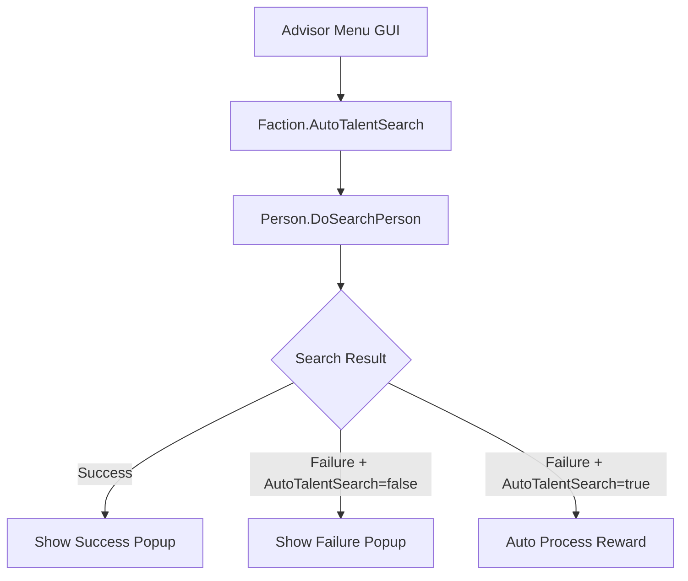

# Design Document

## Overview

This design implements an auto talent search toggle feature that integrates with the existing advisor (军师) system in WorldOfTheThreeKingdoms. The feature adds a toggle button in the advisor menu that controls talent search popup behavior, allowing players to suppress failure notifications while maintaining success alerts.

The implementation leverages the existing Faction class structure with the AutoTalentSearch property and integrates with the current Unity GUI-based advisor menu system. The design ensures minimal impact on existing code while providing a seamless user experience.

## Architecture

### System Integration Points

The feature integrates with three main system components:

1. **Data Layer**: Faction class with AutoTalentSearch property
2. **UI Layer**: Advisor menu GUI system (MainGameScreen.cs)
3. **Logic Layer**: Person talent search processing (Person.cs DoSearchPerson method)

### Component Relationships



## Components and Interfaces

### 1. Data Model Component

**Location**: `WorldOfTheThreeKingdoms/GameObjects/Faction.cs`

The Faction class already contains the required properties:

```csharp
public class Faction : GameObject
{
    // Existing property for yearly frequency control
    public int LastTalentRecommendYear { get; set; } = -1;
    
    // Existing property for auto search toggle
    public bool AutoTalentSearch { get; set; } = false;
}
```

**Responsibilities**:
- Store the auto talent search toggle state
- Persist state through save/load operations
- Maintain yearly frequency control independently

### 2. UI Component

**Location**: `WorldOfTheThreeKingdoms/GameScreens/MainGameScreen.cs`

**Integration Point**: Advisor menu GUI rendering system

```csharp
// In advisor menu rendering method
private void DrawAdvisorMenu(SpriteBatch spriteBatch, Point menuPosition)
{
    // ... existing menu items ...
    
    // Add auto talent search toggle button
    Rectangle toggleRect = new Rectangle(
        menuPosition.X + 10, 
        menuPosition.Y + existingItemsHeight + 5, 
        200, 30
    );
    
    string toggleText = currentFaction.AutoTalentSearch ? 
        "自动举荐：[开]" : "自动举荐：[关]";
    
    if (GUI.Button(toggleRect, toggleText))
    {
        currentFaction.AutoTalentSearch = !currentFaction.AutoTalentSearch;
        // Play click sound if available
        PlayMenuSound();
    }
    
    // Tooltip on hover
    if (toggleRect.Contains(mousePosition))
    {
        ShowTooltip("开启后，若搜寻失败将不再弹窗，自动领取治安奖励；\n只有发现人才时才会弹窗提醒。");
    }
}
```

**Responsibilities**:
- Render the toggle button in advisor menu
- Handle button click events
- Display tooltip on hover
- Provide visual feedback for current state

### 3. Logic Component

**Location**: `WorldOfTheThreeKingdoms/GameObjects/Person.cs`

**Integration Point**: `DoSearchPerson` method and result processing

```csharp
private bool DoSearchPerson(SearchResultPack pack)
{
    // ... existing search logic ...
    
    if (searchSuccessful)
    {
        // Always show success popup regardless of AutoTalentSearch setting
        ShowSearchSuccessPopup(pack);
        return true;
    }
    else
    {
        // Check AutoTalentSearch setting for failure handling
        if (this.BelongedFaction.AutoTalentSearch)
        {
            // Auto mode: process reward silently, no popup
            ProcessSearchFailureReward();
            return false;
        }
        else
        {
            // Manual mode: show failure popup (existing behavior)
            ShowSearchFailurePopup();
            return false;
        }
    }
}

private void ProcessSearchFailureReward()
{
    // Automatically process security reward without user interaction
    // This should replicate the existing reward logic from failure popup
    if (this.TargetArchitecture != null)
    {
        // Apply security reward based on existing calculation
        int securityReward = CalculateSecurityReward();
        this.TargetArchitecture.Morale += securityReward;
    }
}
```

**Responsibilities**:
- Check AutoTalentSearch state before showing failure popups
- Automatically process security rewards in auto mode
- Maintain existing behavior for success cases
- Preserve all existing search logic and calculations

## Data Models

### Faction Class Extensions

The Faction class already contains the necessary properties. No additional data model changes are required:

```csharp
[DataContract]
public class Faction : GameObject
{
    // Existing properties used by this feature
    [DataMember]
    public int LastTalentRecommendYear { get; set; } = -1;
    
    [DataMember] 
    public bool AutoTalentSearch { get; set; } = false;
    
    // ... other existing properties ...
}
```

**Data Persistence**: Both properties are already marked with `[DataMember]` attributes, ensuring they are saved and loaded with game saves.

### UI State Model

No additional UI state models are required. The toggle button state is directly derived from `Faction.AutoTalentSearch`.

## Correctness Properties

*A property is a characteristic or behavior that should hold true across all valid executions of a system-essentially, a formal statement about what the system should do. Properties serve as the bridge between human-readable specifications and machine-verifiable correctness guarantees.*

<function_calls>
<invoke name="prework">
<parameter name="featureName">auto-talent-search-toggle


### Property Reflection

After reviewing all testable criteria from the prework analysis, I've identified opportunities to consolidate related properties:

**Consolidation Opportunities:**
- Properties 1.1, 3.1, and 3.2 all relate to automatic failure handling and can be combined into a comprehensive property about auto-mode behavior
- Properties 2.1, 2.4 relate to button display and can be combined into one property about UI state reflection
- Properties 1.4 and 3.4 both test save/load persistence and can be combined
- Properties 4.4 and 4.5 both ensure LastTalentRecommendYear independence and can be combined

**Redundancy Analysis:**
- Property 4.1 (data model structure) is a prerequisite check, not a runtime property - will be verified during implementation
- Property 4.2 (logic checks AutoTalentSearch) is implementation detail, covered by behavioral properties 1.1 and 1.3
- Property 4.3 (button appears in menu) is covered by property 2.1

After consolidation, we have 8 unique, non-redundant properties that provide comprehensive coverage.

### Correctness Properties

Property 1: Auto mode suppresses failure popups and processes rewards
*For any* talent search attempt that fails, when AutoTalentSearch is true, the system should not display a failure popup and should automatically apply the security reward using the same calculation logic as manual mode.
**Validates: Requirements 1.1, 3.1, 3.2**

Property 2: Success popups always appear
*For any* talent search attempt that succeeds, regardless of the AutoTalentSearch setting, the system should display a success popup to alert the player.
**Validates: Requirements 1.2**

Property 3: Manual mode preserves original behavior
*For any* talent search attempt (success or failure), when AutoTalentSearch is false, the system should display popups exactly as it did before this feature was implemented.
**Validates: Requirements 1.3**

Property 4: Toggle state persists across sessions
*For any* AutoTalentSearch value (true or false), after saving the game and loading it, the AutoTalentSearch property should have the same value it had before saving.
**Validates: Requirements 1.4, 3.4**

Property 5: UI reflects toggle state correctly
*For any* AutoTalentSearch value, the toggle button should display "自动举荐：[开]" when true and "自动举荐：[关]" when false, and the button should be visible in the advisor menu.
**Validates: Requirements 2.1, 2.4**

Property 6: Tooltip appears on hover
*For any* mouse position over the toggle button, the system should display a tooltip with the text "开启后，若搜寻失败将不再弹窗，自动领取治安奖励；\n只有发现人才时才会弹窗提醒。"
**Validates: Requirements 2.2**

Property 7: Button click toggles state immediately
*For any* AutoTalentSearch value, clicking the toggle button should immediately flip the value and update the button text, and should play a click sound if the sound system is available.
**Validates: Requirements 2.3**

Property 8: Default state and backward compatibility
*For any* new game or existing save file without the AutoTalentSearch property, the property should default to false, ensuring backward compatibility and opt-in behavior.
**Validates: Requirements 3.3**

Property 9: Yearly frequency control independence
*For any* combination of AutoTalentSearch and LastTalentRecommendYear values, the yearly talent recommendation frequency control should function identically regardless of the AutoTalentSearch setting.
**Validates: Requirements 1.5, 4.4, 4.5**

## Error Handling

### UI Error Handling

**Null Reference Protection**:
```csharp
// Safely check faction before accessing AutoTalentSearch
if (currentFaction != null)
{
    string toggleText = currentFaction.AutoTalentSearch ? 
        "自动举荐：[开]" : "自动举荐：[关]";
}
```

**Graphics Device Availability**:
```csharp
// Check if graphics device is available before rendering
if (GraphicsDevice != null && !GraphicsDevice.IsDisposed)
{
    DrawAdvisorMenu(spriteBatch, menuPosition);
}
```

### Logic Error Handling

**Safe Reward Processing**:
```csharp
private void ProcessSearchFailureReward()
{
    try
    {
        if (this.TargetArchitecture != null && this.BelongedFaction != null)
        {
            int securityReward = CalculateSecurityReward();
            this.TargetArchitecture.Morale += securityReward;
        }
    }
    catch (Exception ex)
    {
        System.Diagnostics.Debug.WriteLine(
            $"[AutoTalentSearch] Error processing reward: {ex.Message}");
        // Fallback: show popup if auto-processing fails
        ShowSearchFailurePopup();
    }
}
```

### Save/Load Error Handling

**Missing Property Handling**:
The `[DataMember]` attribute with default value ensures that:
- New games automatically get `AutoTalentSearch = false`
- Old saves without the property get `AutoTalentSearch = false` on load
- No migration code is needed

## Testing Strategy

### Dual Testing Approach

This feature requires both unit tests and property-based tests to ensure comprehensive coverage:

**Unit Tests** focus on:
- Specific UI interactions (button click, tooltip display)
- Edge cases (null faction, disposed graphics device)
- Integration points (menu rendering, sound playback)

**Property-Based Tests** focus on:
- Universal behaviors across all search scenarios
- State persistence across save/load cycles
- Independence of AutoTalentSearch and LastTalentRecommendYear

### Property-Based Testing Configuration

**Testing Framework**: Use NUnit with FsCheck for C# property-based testing

**Test Configuration**:
- Minimum 100 iterations per property test
- Each test tagged with feature name and property number
- Tag format: `[Test, Property("auto-talent-search-toggle", 1, "Auto mode suppresses failure popups and processes rewards")]`

**Generator Strategy**:
```csharp
// Smart generators for test data
public static class Generators
{
    // Generate random Faction with various AutoTalentSearch states
    public static Arbitrary<Faction> FactionGen() =>
        Arb.From(Gen.Elements(true, false)
            .Select(autoSearch => new Faction { AutoTalentSearch = autoSearch }));
    
    // Generate search scenarios (success/failure)
    public static Arbitrary<SearchScenario> SearchScenarioGen() =>
        Arb.From(Gen.Elements(SearchResult.Success, SearchResult.Failure)
            .Select(result => new SearchScenario { Result = result }));
}
```

### Unit Test Examples

```csharp
[TestFixture]
public class AutoTalentSearchToggleTests
{
    [Test]
    public void ToggleButton_Click_FlipsState()
    {
        // Arrange
        var faction = new Faction { AutoTalentSearch = false };
        var menu = new AdvisorMenu(faction);
        
        // Act
        menu.OnToggleButtonClick();
        
        // Assert
        Assert.IsTrue(faction.AutoTalentSearch);
    }
    
    [Test]
    public void ToggleButton_DisplaysCorrectText_WhenEnabled()
    {
        // Arrange
        var faction = new Faction { AutoTalentSearch = true };
        var menu = new AdvisorMenu(faction);
        
        // Act
        string text = menu.GetToggleButtonText();
        
        // Assert
        Assert.AreEqual("自动举荐：[开]", text);
    }
    
    [Test]
    public void SearchFailure_NoPopup_WhenAutoEnabled()
    {
        // Arrange
        var faction = new Faction { AutoTalentSearch = true };
        var person = CreateTestPerson(faction);
        bool popupShown = false;
        person.OnShowPopup += () => popupShown = true;
        
        // Act
        person.DoSearchPerson(CreateFailureScenario());
        
        // Assert
        Assert.IsFalse(popupShown);
    }
}
```

### Property Test Examples

```csharp
[TestFixture]
public class AutoTalentSearchPropertyTests
{
    [Test, Property("auto-talent-search-toggle", 1, "Auto mode suppresses failure popups and processes rewards")]
    public Property AutoMode_SuppressesFailurePopups()
    {
        return Prop.ForAll(
            Generators.FactionGen(),
            Generators.SearchScenarioGen(),
            (faction, scenario) =>
            {
                // Given: AutoTalentSearch is enabled and search fails
                faction.AutoTalentSearch = true;
                scenario.Result = SearchResult.Failure;
                
                // When: Search is performed
                bool popupShown = false;
                int rewardBefore = faction.Capital.Morale;
                PerformSearch(faction, scenario, ref popupShown);
                int rewardAfter = faction.Capital.Morale;
                
                // Then: No popup shown and reward processed
                return !popupShown && rewardAfter > rewardBefore;
            });
    }
    
    [Test, Property("auto-talent-search-toggle", 2, "Success popups always appear")]
    public Property SuccessPopups_AlwaysAppear()
    {
        return Prop.ForAll(
            Generators.FactionGen(),
            faction =>
            {
                // Given: Any AutoTalentSearch state and successful search
                var scenario = new SearchScenario { Result = SearchResult.Success };
                
                // When: Search is performed
                bool popupShown = false;
                PerformSearch(faction, scenario, ref popupShown);
                
                // Then: Popup is shown
                return popupShown;
            });
    }
    
    [Test, Property("auto-talent-search-toggle", 4, "Toggle state persists across sessions")]
    public Property ToggleState_PersistsAcrossSessions()
    {
        return Prop.ForAll(
            Arb.From(Gen.Elements(true, false)),
            autoSearchValue =>
            {
                // Given: A faction with specific AutoTalentSearch value
                var faction = new Faction { AutoTalentSearch = autoSearchValue };
                
                // When: Game is saved and loaded
                var saveData = SerializeFaction(faction);
                var loadedFaction = DeserializeFaction(saveData);
                
                // Then: AutoTalentSearch value is preserved
                return loadedFaction.AutoTalentSearch == autoSearchValue;
            });
    }
}
```

### Integration Testing

**Test Scenarios**:
1. Complete workflow: Open advisor menu → Toggle auto search → Perform search → Verify behavior
2. Save/load cycle: Set toggle → Save game → Load game → Verify toggle state
3. Backward compatibility: Load old save → Verify default false → Toggle works correctly

**Manual Testing Checklist**:
- [ ] Toggle button appears in advisor menu
- [ ] Button text updates when clicked
- [ ] Tooltip displays on hover
- [ ] Click sound plays (if sound enabled)
- [ ] Failed search with auto enabled: no popup, reward applied
- [ ] Successful search with auto enabled: popup shown
- [ ] Failed search with auto disabled: popup shown
- [ ] Save/load preserves toggle state
- [ ] Old saves load with toggle defaulting to false
- [ ] Yearly frequency control still works correctly

## Implementation Notes

### Code Locations

**Files to Modify**:
1. `WorldOfTheThreeKingdoms/GameObjects/Faction.cs` - Already contains AutoTalentSearch property
2. `WorldOfTheThreeKingdoms/GameScreens/MainGameScreen.cs` - Add toggle button to advisor menu
3. `WorldOfTheThreeKingdoms/GameObjects/Person.cs` - Modify DoSearchPerson method

**Estimated Lines of Code**:
- UI Component: ~30 lines
- Logic Component: ~20 lines
- Error Handling: ~15 lines
- **Total**: ~65 lines of new/modified code

### Performance Considerations

**Minimal Performance Impact**:
- Single boolean check per search operation (O(1))
- No additional memory allocation
- No impact on save file size (boolean is 1 byte)
- UI rendering adds one button (negligible)

### Backward Compatibility

**Guaranteed Compatibility**:
- Default value `false` ensures existing behavior is preserved
- `[DataMember]` attribute handles serialization automatically
- Old saves without the property will deserialize with default value
- No migration code required

### Future Enhancements

**Potential Improvements**:
1. Add statistics tracking (searches performed, rewards collected)
2. Add notification sound for successful discoveries in auto mode
3. Add configuration for auto-mode behavior (e.g., show brief notification instead of full popup)
4. Add hotkey support for quick toggle