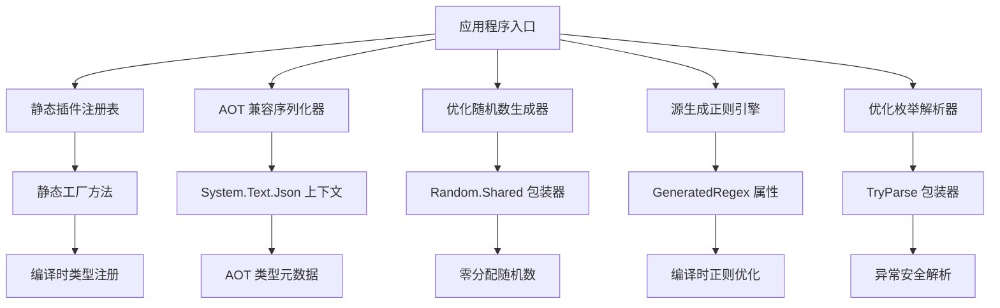

# 设计文档

## 概述

本设计文档详细描述了 WorldOfTheThreeKingdoms 游戏引擎的 Net8 AOT 优化修复方案。该项目旨在完全移除动态类型系统、清理传统 JSON 系统、优化随机数生成、实现正则源生成、优化枚举解析，并确保完全的 AOT 兼容性。

设计方案基于现代 .NET 8 特性，采用源生成器、静态工厂模式和编译时优化技术，在保持向后兼容性的同时显著提升性能。

## 架构

### 整体架构原则

1. **AOT 优先设计**: 所有组件都必须支持 Native AOT 编译
2. **零反射原则**: 移除所有运行时反射和动态类型实例化
3. **编译时优化**: 利用源生成器和编译时特性进行优化
4. **向后兼容**: 确保现有存档和配置文件继续工作
5. **性能优先**: 优化内存分配和 GC 压力

### 核心架构组件



## 组件和接口

### 1. 静态插件系统

#### 接口设计

```csharp
// 静态插件注册接口
public interface IStaticPlugin
{
    string Name { get; }
    string Version { get; }
    void Initialize();
    void Cleanup();
}

// 静态插件注册表
public static class StaticPluginRegistry
{
    private static readonly Dictionary<string, IStaticPlugin> _plugins = new();
    
    public static void RegisterPlugin<T>() where T : IStaticPlugin, new();
    public static T GetPlugin<T>() where T : class, IStaticPlugin;
    public static void InitializeAll();
    public static void CleanupAll();
}
```

#### 实现策略

- 使用源生成器自动发现和注册插件
- 编译时生成插件注册代码
- 移除 Assembly.LoadFrom 和 Activator.CreateInstance

### 2. AOT 兼容序列化系统

#### 核心组件

```csharp
// 扩展的 JSON 上下文
[JsonSourceGenerationOptions(
    WriteIndented = false,
    PropertyNamingPolicy = JsonKnownNamingPolicy.Unspecified,
    DefaultIgnoreCondition = JsonIgnoreCondition.WhenWritingNull,
    IncludeFields = true,
    PropertyNameCaseInsensitive = true,
    AllowTrailingCommas = true,
    ReadCommentHandling = JsonCommentHandling.Skip,
    NumberHandling = JsonNumberHandling.AllowReadingFromString
)]
public partial class EnhancedGameJsonContext : JsonSerializerContext
{
    // 自动生成的类型信息
}

// AOT 兼容序列化器
public static class AOTSerializer
{
    public static string Serialize<T>(T value, bool indented = false);
    public static T Deserialize<T>(string json);
    public static async Task<string> SerializeAsync<T>(T value, CancellationToken cancellationToken = default);
    public static async Task<T> DeserializeAsync<T>(string json, CancellationToken cancellationToken = default);
}
```

#### 转换器架构

```csharp
// 基础转换器接口
public abstract class AOTJsonConverter<T> : JsonConverter<T>
{
    public abstract override T Read(ref Utf8JsonReader reader, Type typeToConvert, JsonSerializerOptions options);
    public abstract override void Write(Utf8JsonWriter writer, T value, JsonSerializerOptions options);
}

// 特定转换器实现
public class EventEffectKindConverter : AOTJsonConverter<EventEffectKind>
public class GameObjectListConverter : AOTJsonConverter<GameObjectList>
public class TextMessageTableConverter : AOTJsonConverter<TextMessageTable>
```

### 3. 优化随机数生成系统

#### 接口设计

```csharp
// 随机数生成器接口
public interface IRandomGenerator
{
    int Next();
    int Next(int maxValue);
    int Next(int minValue, int maxValue);
    double NextDouble();
    void NextBytes(byte[] buffer);
    void NextBytes(Span<byte> buffer);
}

// AOT 优化的随机数生成器
public static class OptimizedRandom
{
    public static IRandomGenerator Shared { get; }
    public static int Next() => Random.Shared.Next();
    public static int Next(int maxValue) => Random.Shared.Next(maxValue);
    public static int Next(int minValue, int maxValue) => Random.Shared.Next(minValue, maxValue);
    public static double NextDouble() => Random.Shared.NextDouble();
}
```

#### 实现策略

- 全面使用 Random.Shared 替代 new Random()
- 提供统一的随机数生成接口
- 零分配的随机数生成

### 4. 源生成正则表达式系统

#### 实现方案

```csharp
// 正则表达式生成器
public static partial class RegexPatterns
{
    [GeneratedRegex(@"\d+", RegexOptions.Compiled)]
    public static partial Regex NumberPattern();
    
    [GeneratedRegex(@"[a-zA-Z]+", RegexOptions.Compiled)]
    public static partial Regex WordPattern();
    
    [GeneratedRegex(@"\s+", RegexOptions.Compiled)]
    public static partial Regex WhitespacePattern();
}

// 正则表达式工具类
public static class RegexTools
{
    public static bool IsNumber(string input) => RegexPatterns.NumberPattern().IsMatch(input);
    public static bool IsWord(string input) => RegexPatterns.WordPattern().IsMatch(input);
    public static string[] SplitWords(string input) => RegexPatterns.WhitespacePattern().Split(input);
}
```

### 5. 优化枚举解析系统

#### 接口设计

```csharp
// 枚举解析器接口
public interface IEnumParser<T> where T : struct, Enum
{
    bool TryParse(string value, out T result);
    bool TryParse(ReadOnlySpan<char> value, out T result);
    T ParseOrDefault(string value, T defaultValue = default);
}

// 通用枚举解析器
public static class EnumParser<T> where T : struct, Enum
{
    public static bool TryParse(string value, out T result) => Enum.TryParse<T>(value, true, out result);
    public static bool TryParse(ReadOnlySpan<char> value, out T result) => Enum.TryParse<T>(value, true, out result);
    public static T ParseOrDefault(string value, T defaultValue = default) => 
        TryParse(value, out var result) ? result : defaultValue;
}
```

## 数据模型

### 1. 插件元数据模型

```csharp
// 插件元数据
public record PluginMetadata(
    string Name,
    string Version,
    string Description,
    Type PluginType,
    string[] Dependencies
);

// 插件注册信息
public record PluginRegistration(
    PluginMetadata Metadata,
    Func<IStaticPlugin> Factory
);
```

### 2. 序列化配置模型

```csharp
// 序列化配置
public record SerializationConfig(
    bool WriteIndented,
    bool IgnoreNullValues,
    bool CaseSensitive,
    bool AllowTrailingCommas,
    JsonNamingPolicy NamingPolicy
);

// 类型注册信息
public record TypeRegistration(
    Type Type,
    JsonTypeInfo TypeInfo,
    JsonConverter Converter
);
```

### 3. 性能监控模型

```csharp
// 性能指标
public record PerformanceMetrics(
    TimeSpan SerializationTime,
    TimeSpan DeserializationTime,
    long MemoryAllocated,
    int GCCollections,
    double RandomGenerationRate
);

// 优化结果
public record OptimizationResult(
    string ComponentName,
    PerformanceMetrics Before,
    PerformanceMetrics After,
    double ImprovementPercentage
);
```

## 正确性属性

*属性是一个特征或行为，应该在系统的所有有效执行中保持为真——本质上，是关于系统应该做什么的正式陈述。属性作为人类可读规范和机器可验证正确性保证之间的桥梁。*

基于需求分析，以下是系统必须满足的正确性属性：

### 属性 1: AOT 兼容性约束
*对于任何* 系统组件，当系统启动或运行时，不应使用 Assembly.LoadFrom、Activator.CreateInstance 或其他运行时反射 API 进行动态类型实例化
**验证: 需求 1.1, 1.2, 1.3**

### 属性 2: 静态工厂模式一致性
*对于任何* 需要动态功能的组件，系统应使用 AOT 兼容的替代方案（源生成器或静态工厂方法）而不是反射
**验证: 需求 1.5**

### 属性 3: JSON 序列化系统一致性
*对于任何* JSON 序列化或反序列化操作，系统应使用 System.Text.Json 及其转换器，而不是 Newtonsoft.Json
**验证: 需求 2.2, 2.4, 2.5**

### 属性 4: 随机数生成优化
*对于任何* 需要随机数的组件，系统应使用 Random.Shared 而不是创建新的 Random 实例
**验证: 需求 3.1, 3.2, 3.3, 3.4**

### 属性 5: 内存分配优化
*对于任何* 随机数生成操作，系统不应创建不必要的 Random 对象分配
**验证: 需求 3.5**

### 属性 6: 正则表达式源生成
*对于任何* 正则表达式处理，系统应使用 GeneratedRegex 属性而不是运行时创建 Regex 实例
**验证: 需求 4.1, 4.2, 4.3, 4.4**

### 属性 7: 枚举解析安全性
*对于任何* 枚举解析操作，系统应使用 Enum.TryParse<T> 而不是 Enum.Parse，并优雅处理解析失败
**验证: 需求 5.1, 5.2**

### 属性 8: 枚举解析验证
*对于任何* 包含枚举值的配置数据处理，系统应验证枚举解析结果并提供有意义的错误消息
**验证: 需求 5.3, 5.4**

### 属性 9: 性能优化验证
*对于任何* 优化后的组件（随机数生成、正则处理、枚举解析），系统应展示相比之前实现的性能提升
**验证: 需求 7.1, 7.2, 7.3**

### 属性 10: 内存和启动性能
*对于任何* 系统运行场景，优化后的系统应展示减少的垃圾回收压力和更快的启动时间
**验证: 需求 7.4, 7.5**

### 属性 11: 向后兼容性保证
*对于任何* 现有的存档文件、配置文件或游戏数据，系统应使用新的优化系统正确处理并保持相同的功能
**验证: 需求 8.1, 8.2, 8.3**

### 属性 12: 数据迁移兼容性
*对于任何* 旧数据格式，系统应优雅地处理它们或提供清晰的迁移路径，同时保持 UI 行为和外观的一致性
**验证: 需求 8.4, 8.5**

## 错误处理

### 1. AOT 编译错误处理

#### 编译时错误检测
- **类型注册缺失**: 当 GameJsonContext 中缺少类型注册时，提供明确的错误消息指导开发者添加 [JsonSerializable] 属性
- **反射使用检测**: 在编译时检测不兼容的反射使用，并提供 AOT 兼容的替代方案建议
- **依赖项兼容性**: 验证所有第三方依赖项的 AOT 兼容性

#### 运行时错误处理
```csharp
// AOT 兼容性错误
public class AOTCompatibilityException : Exception
{
    public string ComponentName { get; }
    public string SuggestedFix { get; }
    
    public AOTCompatibilityException(string componentName, string message, string suggestedFix) 
        : base($"AOT 兼容性错误在 {componentName}: {message}. 建议修复: {suggestedFix}")
    {
        ComponentName = componentName;
        SuggestedFix = suggestedFix;
    }
}
```

### 2. 序列化错误处理

#### JSON 序列化错误
```csharp
// 序列化错误处理策略
public static class SerializationErrorHandler
{
    public static T HandleDeserializationError<T>(Exception ex, string context)
    {
        if (ex.Message.Contains("JsonTypeInfo metadata"))
        {
            string missingType = ExtractMissingTypeFromError(ex.Message);
            throw new AOTCompatibilityException(
                "JSON序列化器", 
                $"类型 {missingType} 未在 GameJsonContext 中注册",
                $"在 GameJsonContext 中添加 [JsonSerializable(typeof({missingType}))]"
            );
        }
        
        // 记录错误并返回默认值或重新抛出
        LogError($"序列化错误在 {context}: {ex.Message}");
        return default(T);
    }
}
```

### 3. 插件系统错误处理

#### 静态插件注册错误
```csharp
// 插件注册错误
public class PluginRegistrationException : Exception
{
    public string PluginName { get; }
    
    public PluginRegistrationException(string pluginName, string message) 
        : base($"插件注册失败 {pluginName}: {message}")
    {
        PluginName = pluginName;
    }
}

// 插件初始化错误处理
public static class PluginErrorHandler
{
    public static void HandleInitializationError(string pluginName, Exception ex)
    {
        LogError($"插件 {pluginName} 初始化失败: {ex.Message}");
        
        // 根据错误类型决定是否继续
        if (ex is AOTCompatibilityException)
        {
            throw; // AOT 兼容性错误必须修复
        }
        
        // 其他错误可以继续，但记录警告
        LogWarning($"插件 {pluginName} 将被跳过");
    }
}
```

### 4. 性能监控和错误恢复

#### 性能回退机制
```csharp
// 性能监控和回退
public static class PerformanceMonitor
{
    public static T ExecuteWithFallback<T>(
        Func<T> optimizedOperation,
        Func<T> fallbackOperation,
        string operationName)
    {
        try
        {
            var stopwatch = Stopwatch.StartNew();
            var result = optimizedOperation();
            stopwatch.Stop();
            
            LogPerformance(operationName, stopwatch.Elapsed);
            return result;
        }
        catch (Exception ex) when (IsPerformanceRelated(ex))
        {
            LogWarning($"优化操作 {operationName} 失败，使用回退方案: {ex.Message}");
            return fallbackOperation();
        }
    }
}
```

## 测试策略

### 双重测试方法

本项目采用单元测试和基于属性的测试相结合的综合测试策略：

- **单元测试**: 验证特定示例、边缘情况和错误条件
- **基于属性的测试**: 验证所有输入的通用属性
- 两者互补，确保全面覆盖（单元测试捕获具体错误，属性测试验证一般正确性）

### 单元测试策略

单元测试专注于：
- 特定示例，展示正确行为
- 组件之间的集成点
- 边缘情况和错误条件
- AOT 编译验证
- 向后兼容性测试

避免编写过多单元测试 - 基于属性的测试处理大量输入覆盖。

### 基于属性的测试配置

- **最少 100 次迭代**每个属性测试（由于随机化）
- 每个属性测试必须引用其设计文档属性
- 标签格式: **Feature: net8-aot-optimization-fixes, Property {number}: {property_text}**
- 每个正确性属性必须由单个基于属性的测试实现

### 测试框架选择

推荐使用 **FsCheck** 或 **Hedgehog** 进行基于属性的测试：

```csharp
// 示例属性测试配置
[Property]
[Tag("Feature: net8-aot-optimization-fixes, Property 4: 随机数生成优化")]
public Property RandomGenerationUsesSharedInstance()
{
    return Prop.ForAll<string>(componentName =>
    {
        // 验证组件使用 Random.Shared 而不是新实例
        var randomUsage = AnalyzeRandomUsage(componentName);
        return randomUsage.UsesSharedInstance && !randomUsage.CreatesNewInstances;
    });
}
```

### 性能基准测试

使用 **BenchmarkDotNet** 进行性能验证：

```csharp
[MemoryDiagnoser]
[SimpleJob(RuntimeMoniker.Net80)]
public class OptimizationBenchmarks
{
    [Benchmark(Baseline = true)]
    public void OldRandomGeneration() { /* 旧实现 */ }
    
    [Benchmark]
    public void OptimizedRandomGeneration() { /* 新实现 */ }
    
    [Benchmark(Baseline = true)]
    public void OldRegexProcessing() { /* 旧实现 */ }
    
    [Benchmark]
    public void GeneratedRegexProcessing() { /* 新实现 */ }
}
```

### AOT 兼容性测试

```csharp
// AOT 编译验证测试
[Test]
public void AOT_Compilation_Should_Succeed_Without_Warnings()
{
    var compilationResult = CompileWithAOT();
    Assert.That(compilationResult.Warnings, Is.Empty);
    Assert.That(compilationResult.Success, Is.True);
}

// 运行时 AOT 功能测试
[Test]
public void AOT_Runtime_Should_Maintain_All_Functionality()
{
    // 在 AOT 模式下运行核心功能测试
    var testSuite = new CoreFunctionalityTests();
    var results = testSuite.RunInAOTMode();
    Assert.That(results.AllPassed, Is.True);
}
```