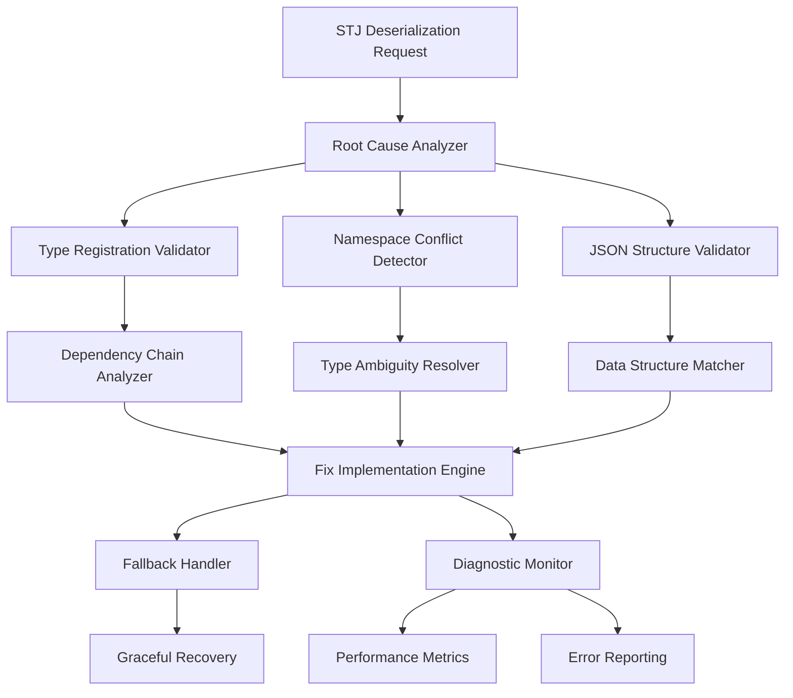

# Design Document: STJ Deserialization Root Cause Fix

## Overview

This design addresses the persistent System.Text.Json (STJ) deserialization failure affecting `GameObjects.ArchitectureDetail.EventEffect.EventEffectKindTable` in the WorldOfTheThreeKingdoms game system. Despite existing type registrations in GameJsonContext, the error persists, indicating a deeper issue in the type resolution chain.

The solution implements a comprehensive diagnostic and fix system that systematically identifies the root cause and provides permanent resolution with robust error handling and monitoring capabilities.

## Architecture

The system follows a layered diagnostic approach:



The architecture separates concerns into distinct layers:
- **Analysis Layer**: Identifies root causes through systematic examination
- **Resolution Layer**: Implements targeted fixes based on analysis results
- **Recovery Layer**: Provides fallback mechanisms and monitoring
- **Monitoring Layer**: Tracks system health and prevents regression

## Components and Interfaces

### Root Cause Analyzer

**Purpose**: Systematically diagnose STJ deserialization failures through comprehensive analysis.

**Key Methods**:
```csharp
public interface IRootCauseAnalyzer
{
    Task<DiagnosticResult> AnalyzeDeserializationFailure(
        Type targetType, 
        string jsonData, 
        JsonSerializerOptions options);
    
    Task<TypeRegistrationReport> ValidateTypeRegistrationChain(Type rootType);
    Task<NamespaceConflictReport> DetectNamespaceConflicts(Type targetType);
    Task<StructuralMismatchReport> ValidateJsonStructure(Type targetType, string jsonData);
}
```

**Analysis Process**:
1. **Type Registration Chain Analysis**: Traverses the complete dependency graph from the target type through all referenced types, validating each has proper JsonSerializable registration
2. **Namespace Conflict Detection**: Identifies ambiguous type references between `TroopDetail.EventEffect` and `ArchitectureDetail.EventEffect` namespaces
3. **Polymorphic Type Validation**: Ensures all derived EventEffectKind types are registered
4. **JSON Structure Validation**: Compares actual JSON structure against expected class schema

### Type Registration Validator

**Purpose**: Comprehensive validation of STJ type registrations and dependencies.

**Key Methods**:
```csharp
public interface ITypeRegistrationValidator
{
    ValidationResult ValidateEventEffectKindTableRegistration();
    ValidationResult ValidateDependentTypes(Type rootType);
    ValidationResult ValidatePolymorphicTypes(Type baseType);
    ValidationResult ValidateJsonSerializerOptions(JsonSerializerOptions options);
    Task<RegistrationFixPlan> GenerateFixPlan(ValidationResult result);
}
```

**Validation Scope**:
- EventEffectKindTable registrations for both TroopDetail and ArchitectureDetail namespaces
- Dictionary<int, EventEffectKind> type registrations
- All EventEffectKind derived classes and their properties
- Circular dependency detection in type hierarchy
- JsonSerializerContext configuration validation

### Deserialization Tester

**Purpose**: Isolated testing of STJ deserialization without external dependencies.

**Key Methods**:
```csharp
public interface IDeserializationTester
{
    Task<TestResult> TestEventEffectKindTableDeserialization(string jsonData);
    Task<TestResult> TestBothNamespaceVariants();
    Task<TestResult> TestWithActualGameData();
    Task<TestResult> TestEdgeCases();
    TestSuite GenerateComprehensiveTestSuite();
}
```

**Testing Strategy**:
- Minimal test cases using synthetic data
- Real game data validation
- Edge case testing (empty dictionaries, null values, malformed JSON)
- Performance benchmarking
- Cross-namespace compatibility testing

### Fallback Handler

**Purpose**: Graceful error recovery and system stability maintenance.

**Key Methods**:
```csharp
public interface IFallbackHandler
{
    Task<T> HandleDeserializationFailure<T>(
        string jsonData, 
        JsonSerializerOptions primaryOptions,
        Exception originalException);
    
    Task<bool> AttemptDataRepair(string jsonData, Type targetType);
    Task<T> UseDefaultValues<T>() where T : new();
    void LogDiagnosticInformation(Exception exception, string context);
}
```

**Recovery Mechanisms**:
- Progressive fallback through different JsonSerializerOptions configurations
- JSON data repair for common corruption patterns
- Default value substitution for critical system components
- Comprehensive error logging with actionable diagnostic information

## Data Models

### DiagnosticResult

```csharp
public class DiagnosticResult
{
    public bool IsSuccessful { get; set; }
    public List<DiagnosticIssue> Issues { get; set; }
    public TypeRegistrationReport TypeRegistrations { get; set; }
    public NamespaceConflictReport NamespaceConflicts { get; set; }
    public StructuralMismatchReport StructuralMismatches { get; set; }
    public FixRecommendation RecommendedFix { get; set; }
}

public class DiagnosticIssue
{
    public IssueSeverity Severity { get; set; }
    public IssueCategory Category { get; set; }
    public string Description { get; set; }
    public string DetailedAnalysis { get; set; }
    public List<string> RecommendedActions { get; set; }
}
```

### TypeRegistrationReport

```csharp
public class TypeRegistrationReport
{
    public Dictionary<Type, RegistrationStatus> TypeRegistrations { get; set; }
    public List<Type> MissingRegistrations { get; set; }
    public List<Type> CircularDependencies { get; set; }
    public Dictionary<Type, List<Type>> DependencyChain { get; set; }
}

public enum RegistrationStatus
{
    Registered,
    Missing,
    Ambiguous,
    CircularDependency
}
```

### FixRecommendation

```csharp
public class FixRecommendation
{
    public FixStrategy Strategy { get; set; }
    public List<TypeRegistrationFix> TypeFixes { get; set; }
    public List<ConfigurationFix> ConfigurationFixes { get; set; }
    public List<CodeFix> CodeFixes { get; set; }
    public EstimatedImpact Impact { get; set; }
}

public enum FixStrategy
{
    AddMissingRegistrations,
    ResolveNamespaceConflicts,
    UpdatePolymorphicRegistrations,
    RepairJsonStructure,
    ComprehensiveOverhaul
}
```

## Correctness Properties

*A property is a characteristic or behavior that should hold true across all valid executions of a system-essentially, a formal statement about what the system should do. Properties serve as the bridge between human-readable specifications and machine-verifiable correctness guarantees.*

Based on the prework analysis, the following properties validate the system's correctness:

**Property 1: Complete Type Registration Chain Analysis**
*For any* type with deserialization errors, the Root_Cause_Analyzer should examine the complete dependency chain and verify all dependent types are registered
**Validates: Requirements 1.1, 1.2, 1.5**

**Property 2: Comprehensive Type Registration Validation**
*For any* type registration scenario, the Type_Registration_Validator should verify all EventEffectKind-related types, their dependencies, and Dictionary types are properly registered
**Validates: Requirements 2.1, 2.2, 2.3, 5.2**

**Property 3: Namespace Conflict Detection**
*For any* type with potential namespace ambiguity, the system should identify conflicts between TroopDetail and ArchitectureDetail namespaces
**Validates: Requirements 1.3**

**Property 4: JSON Structure Validation**
*For any* JSON data and target type combination, the system should validate structural compatibility and detect mismatches
**Validates: Requirements 1.4**

**Property 5: Circular Dependency Detection**
*For any* type hierarchy with potential cycles, the system should detect and report circular type references
**Validates: Requirements 2.4**

**Property 6: Configuration Validation**
*For any* JsonSerializerOptions instance, the system should verify proper GameJsonContext configuration
**Validates: Requirements 2.5**

**Property 7: Comprehensive Deserialization Testing**
*For any* type being tested, the Deserialization_Tester should create test cases covering both namespace variants, real data, and edge cases
**Validates: Requirements 3.1, 3.2, 3.3, 3.4**

**Property 8: Detailed Error Reporting**
*For any* test failure or error condition, the system should provide detailed diagnostic information
**Validates: Requirements 3.5, 4.2, 6.3**

**Property 9: Graceful Error Recovery**
*For any* deserialization failure, the Fallback_Handler should provide recovery mechanisms while maintaining system stability
**Validates: Requirements 4.1, 4.3, 4.5**

**Property 10: Progressive Error Escalation**
*For any* multiple failure scenario, the system should escalate with comprehensive error context
**Validates: Requirements 4.4**

**Property 11: Complete Root Cause Resolution**
*For any* identified root cause, the fix implementation should completely address the issue and maintain backward compatibility
**Validates: Requirements 5.1, 5.3**

**Property 12: Comprehensive Test Coverage**
*For any* fix implementation, the system should include tests that prevent regression and validate the solution
**Validates: Requirements 5.4, 5.5**

**Property 13: System Health Monitoring**
*For any* system operation, the Diagnostic_System should validate registrations, log metrics, and track usage patterns
**Validates: Requirements 6.1, 6.2, 6.4**

**Property 14: Actionable Diagnostic Reporting**
*For any* diagnostic report generation, the system should provide actionable insights for preventing future issues
**Validates: Requirements 6.5**

<function_calls>
<invoke name="prework">
<parameter name="featureName">stj-deserialization-root-cause-fix

## Error Handling

The system implements a multi-layered error handling strategy designed to provide comprehensive diagnostics while maintaining system stability:

### Error Classification

**Critical Errors**: Type registration failures that prevent deserialization
- Missing JsonSerializable attributes
- Circular dependency loops
- Namespace ambiguity conflicts

**Recoverable Errors**: JSON data issues that can be repaired or worked around
- Malformed JSON structure
- Missing optional properties
- Type conversion failures

**Warning Conditions**: Performance or compatibility issues that don't prevent operation
- Deprecated type usage
- Suboptimal configuration
- Performance degradation

### Recovery Mechanisms

**Progressive Fallback Strategy**:
1. **Primary**: Use optimized GameJsonContext with strict validation
2. **Secondary**: Use loose JsonSerializerOptions with relaxed validation
3. **Tertiary**: Attempt JSON data repair and retry
4. **Final**: Use default values and log comprehensive diagnostic information

**Data Repair Capabilities**:
- Fix common JSON formatting issues (trailing commas, unescaped characters)
- Handle legacy data format conversions
- Repair missing required properties with sensible defaults
- Convert between compatible type representations

### Diagnostic Information Capture

**Error Context Collection**:
- Complete stack trace with source location information
- JSON data snippet showing the problematic section
- Type hierarchy analysis showing registration status
- Configuration dump of JsonSerializerOptions
- Performance metrics at time of failure

**Actionable Error Messages**:
- Specific missing type registrations with exact attribute syntax
- Namespace conflict resolution suggestions
- JSON structure mismatch details with expected vs actual format
- Performance optimization recommendations

## Testing Strategy

The testing approach combines comprehensive unit testing with property-based testing to ensure robust validation across all scenarios:

### Unit Testing Strategy

**Specific Scenario Testing**:
- Known EventEffectKindTable deserialization failures
- Namespace conflict edge cases between TroopDetail and ArchitectureDetail
- JSON data corruption scenarios from actual game saves
- Performance regression testing with large datasets
- Integration testing with actual GameJsonContext configuration

**Error Condition Testing**:
- Missing type registration scenarios
- Circular dependency detection
- Malformed JSON handling
- Fallback mechanism validation
- Diagnostic information accuracy

### Property-Based Testing Configuration

**Testing Framework**: Use NUnit with FsCheck.NUnit for C# property-based testing
**Test Configuration**: Minimum 100 iterations per property test
**Test Tagging**: Each property test references its design document property

**Property Test Examples**:

```csharp
[Property]
[Category("Feature: stj-deserialization-root-cause-fix, Property 1: Complete Type Registration Chain Analysis")]
public Property CompleteTypeRegistrationChainAnalysis(Type targetType)
{
    return Prop.ForAll(
        Arb.From<Type>().Where(t => HasDeserializationError(t)),
        type => {
            var analyzer = new RootCauseAnalyzer();
            var result = analyzer.AnalyzeDeserializationFailure(type, "{}", options);
            return result.TypeRegistrations.DependencyChain.ContainsKey(type) &&
                   result.TypeRegistrations.DependencyChain[type].All(dep => 
                       IsRegisteredInGameJsonContext(dep));
        });
}

[Property]
[Category("Feature: stj-deserialization-root-cause-fix, Property 9: Graceful Error Recovery")]
public Property GracefulErrorRecovery(string jsonData, Type targetType)
{
    return Prop.ForAll(
        Arb.From<string>().Where(json => CausesDeserializationFailure(json, targetType)),
        Arb.From<Type>(),
        (json, type) => {
            var handler = new FallbackHandler();
            var result = handler.HandleDeserializationFailure(json, options, new Exception());
            return result != null && SystemRemainsStable();
        });
}
```

### Integration Testing

**End-to-End Scenarios**:
- Complete diagnostic workflow from error detection to fix implementation
- Real game data deserialization with all EventEffectKindTable variants
- Performance testing under high load conditions
- Backward compatibility validation with existing save files

**Regression Prevention**:
- Automated testing of all previously failing scenarios
- Continuous validation of type registration completeness
- Performance benchmark maintenance
- Configuration drift detection

### Test Data Management

**Synthetic Test Data**:
- Generated EventEffectKindTable instances with various configurations
- Malformed JSON samples covering common corruption patterns
- Type hierarchies with intentional registration gaps
- Performance stress test datasets

**Real Game Data**:
- Anonymized save files from actual gameplay sessions
- Historical data from previous versions for compatibility testing
- Edge case scenarios reported by users
- Performance profiling data from production environments

The dual testing approach ensures both specific known issues are resolved and general correctness properties hold across all possible inputs, providing comprehensive coverage and confidence in the solution's robustness.