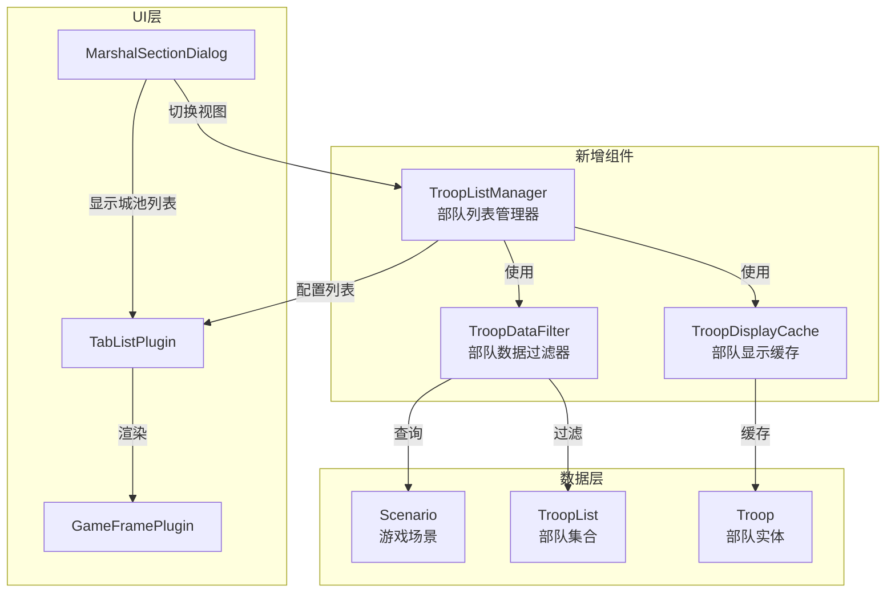
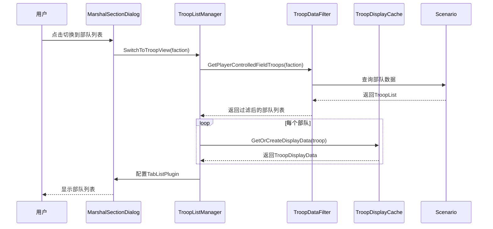
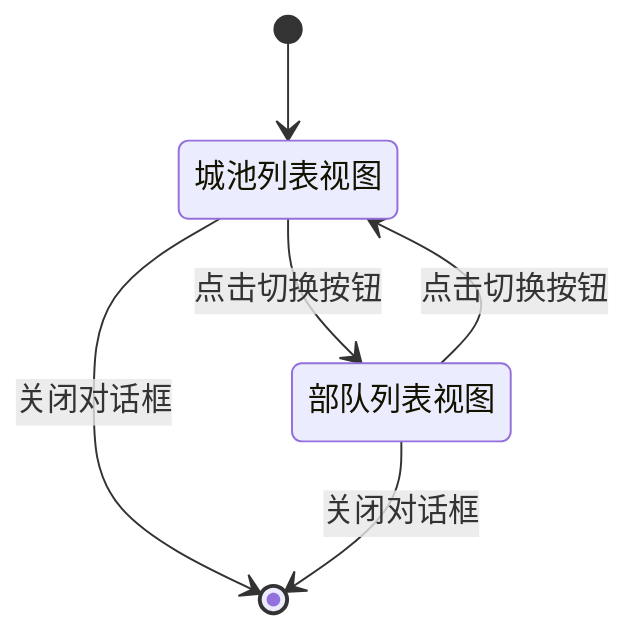
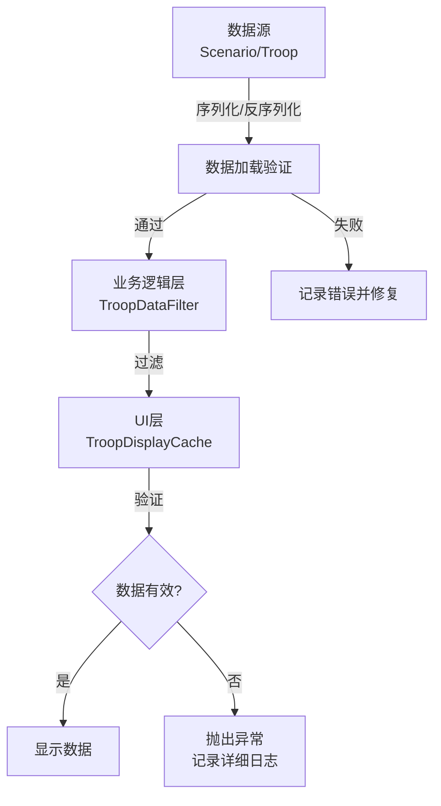

# 技术设计文档：部队列表显示功能

## 概述

本设计文档描述了部队列表显示功能的技术实现方案。该功能在现有城池列表界面基础上，增加一个部队列表视图，用于显示所有玩家手动控制的城外部队。两个列表视图可以通过切换按钮互相切换，但不能同时显示。

### 设计目标

1. **最小侵入性**: 复用现有的TabListPlugin框架，避免重复造轮子
2. **性能优化**: UI更新属于冷路径，可使用LINQ提高可读性，但需实现对象池和缓存机制
3. **数据完整性**: 在数据源头验证，UI层使用断言/异常快速失败
4. **AOT兼容**: 使用C# 12语法，禁用反射
5. **互斥显示**: 城池列表和部队列表同一时间只能显示一个

### 技术栈

- .NET 8, C# 12
- MonoGame框架
- 现有TabListPlugin UI框架
- 现有MarshalSectionDialog架构模式

## 架构设计

### 系统架构图



### 组件职责

#### 1. TroopListManager（部队列表管理器）
- **职责**: 协调部队列表的显示和更新
- **位置**: `WorldOfTheThreeKingdoms/GamePlugins/MarshalSectionDialogPlugin/TroopListManager.cs`
- **生命周期**: 由MarshalSectionDialog创建和管理
- **关键方法**:
  - `InitializeTroopList()`: 初始化部队列表视图
  - `RefreshTroopList()`: 刷新部队列表数据
  - `SwitchToTroopView()`: 切换到部队列表视图
  - `SwitchToArchitectureView()`: 切换到城池列表视图

#### 2. TroopDataFilter（部队数据过滤器）
- **职责**: 从游戏场景中筛选符合条件的部队
- **位置**: `WorldOfTheThreeKingdoms/GamePlugins/MarshalSectionDialogPlugin/TroopDataFilter.cs`
- **过滤条件**:
  - 属于当前玩家势力
  - 位于城外（不在城池内）
  - 玩家手动控制（不由AI军团控制）
- **关键方法**:
  - `GetPlayerControlledFieldTroops(Faction faction)`: 获取玩家手动控制的城外部队

#### 3. TroopDisplayCache（部队显示缓存）
- **职责**: 缓存部队显示数据，减少重复计算
- **位置**: `WorldOfTheThreeKingdoms/GamePlugins/MarshalSectionDialogPlugin/TroopDisplayCache.cs`
- **缓存内容**:
  - 部队ID到显示数据的映射
  - 上次更新时间戳
- **关键方法**:
  - `GetOrCreateDisplayData(Troop troop)`: 获取或创建显示数据
  - `InvalidateCache()`: 使缓存失效
  - `Clear()`: 清空缓存

#### 4. MarshalSectionDialog扩展
- **修改内容**: 添加部队列表视图切换逻辑
- **新增方法**:
  - `ShowTroopListFrame()`: 显示部队列表框架
  - `OnViewModeChanged(ViewMode mode)`: 视图模式切换回调

## 组件和接口

### 数据模型

#### TroopDisplayData（部队显示数据）

```csharp
namespace MarshalSectionDialogPlugin;

/// <summary>
/// 部队显示数据记录
/// </summary>
/// <param name="TroopId">部队ID</param>
/// <param name="Name">部队名称</param>
/// <param name="MilitaryKindName">兵种名称</param>
/// <param name="Quantity">当前人数</param>
/// <param name="HasCommand">是否已下达指令</param>
/// <param name="StatusText">当前状态文本</param>
public sealed record TroopDisplayData(
    int TroopId,
    string Name,
    string MilitaryKindName,
    int Quantity,
    bool HasCommand,
    string StatusText
);
```

#### ViewMode（视图模式枚举）

```csharp
namespace MarshalSectionDialogPlugin;

/// <summary>
/// 列表视图模式
/// </summary>
public enum ViewMode
{
    /// <summary>城池列表视图</summary>
    Architecture,
    /// <summary>部队列表视图</summary>
    Troop
}
```

### 核心接口

#### ITroopDataFilter

```csharp
namespace MarshalSectionDialogPlugin;

/// <summary>
/// 部队数据过滤器接口
/// </summary>
public interface ITroopDataFilter
{
    /// <summary>
    /// 获取玩家手动控制的城外部队
    /// </summary>
    /// <param name="faction">玩家势力</param>
    /// <returns>符合条件的部队列表</returns>
    IReadOnlyList<Troop> GetPlayerControlledFieldTroops(Faction faction);
}
```

#### ITroopDisplayCache

```csharp
namespace MarshalSectionDialogPlugin;

/// <summary>
/// 部队显示缓存接口
/// </summary>
public interface ITroopDisplayCache
{
    /// <summary>
    /// 获取或创建部队显示数据
    /// </summary>
    /// <param name="troop">部队实体</param>
    /// <returns>显示数据</returns>
    TroopDisplayData GetOrCreateDisplayData(Troop troop);
    
    /// <summary>
    /// 使缓存失效
    /// </summary>
    void InvalidateCache();
    
    /// <summary>
    /// 清空缓存
    /// </summary>
    void Clear();
}
```

### 类设计

#### TroopDataFilter实现

```csharp
namespace MarshalSectionDialogPlugin;

/// <summary>
/// 部队数据过滤器实现（使用C# 12主构造函数）
/// </summary>
public sealed class TroopDataFilter(Scenario scenario) : ITroopDataFilter
{
    // 主构造函数参数自动成为私有字段
    
    public IReadOnlyList<Troop> GetPlayerControlledFieldTroops(Faction faction)
    {
        ArgumentNullException.ThrowIfNull(faction);
        ArgumentNullException.ThrowIfNull(scenario);
        
        // 冷路径：UI更新，可使用LINQ提高可读性
        // 注意：不使用?.运算符，如果Army为null会立即失败（快速失败原则）
        // 数据完整性应该在序列化/反序列化阶段保证
        return scenario.Troops
            .Where(t => t.BelongedFaction == faction)           // 属于玩家势力
            .Where(t => t.LocationArchitecture == null)         // 城外部队
            .Where(t => t.Army.BelongedLegion == null)          // 不属于AI军团（直接访问Army）
            .ToList();
    }
}
```

#### TroopDisplayCache实现

```csharp
namespace MarshalSectionDialogPlugin;

/// <summary>
/// 部队显示缓存实现
/// </summary>
public sealed class TroopDisplayCache : ITroopDisplayCache
{
    private readonly Dictionary<int, TroopDisplayData> _cache = [];
    private readonly Dictionary<int, int> _lastQuantity = [];
    
    public TroopDisplayData GetOrCreateDisplayData(Troop troop)
    {
        ArgumentNullException.ThrowIfNull(troop);
        ValidateTroopData(troop);
        
        // 检查缓存是否需要更新
        if (_cache.TryGetValue(troop.ID, out var cached))
        {
            // 如果人数未变化，直接返回缓存
            if (_lastQuantity.TryGetValue(troop.ID, out var lastQty) && 
                lastQty == troop.Army.Quantity)
            {
                return cached;
            }
        }
        
        // 创建新的显示数据
        var displayData = CreateDisplayData(troop);
        _cache[troop.ID] = displayData;
        _lastQuantity[troop.ID] = troop.Army.Quantity;
        
        return displayData;
    }
    
    public void InvalidateCache()
    {
        _cache.Clear();
        // 保留_lastQuantity用于增量更新检测
    }
    
    public void Clear()
    {
        _cache.Clear();
        _lastQuantity.Clear();
    }
    
    private static TroopDisplayData CreateDisplayData(Troop troop)
    {
        // 注意：ValidateTroopData已经验证了所有字段非null，这里直接访问
        // 如果出现null，说明验证逻辑有bug，应该立即失败
        return new TroopDisplayData(
            TroopId: troop.ID,
            Name: troop.Name ?? throw new InvalidOperationException($"部队 {troop.ID} 名称为null"),
            MilitaryKindName: troop.Army.Kind.Name ?? throw new InvalidOperationException($"部队 {troop.ID} 兵种名称为null"),
            Quantity: troop.Army.Quantity,
            HasCommand: HasActiveCommand(troop),
            StatusText: GetStatusText(troop)
        );
    }
    
    private static bool HasActiveCommand(Troop troop)
    {
        // 检查部队是否有活动指令
        return troop.WillArchitecture != null || 
               troop.Status != TroopStatus.待命;
    }
    
    private static string GetStatusText(Troop troop)
    {
        return troop.Status switch
        {
            TroopStatus.移动中 => "移动中",
            TroopStatus.待命 => "待命",
            TroopStatus.战斗中 => "战斗中",
            TroopStatus.埋伏 => "埋伏",
            TroopStatus.混乱 => "混乱",
            _ => "未知"
        };
    }
    
    private static void ValidateTroopData(Troop troop)
    {
        Debug.Assert(troop != null, "部队不能为null");
        Debug.Assert(troop.Name != null, $"部队 {troop.ID} 名称不能为null");
        Debug.Assert(troop.Army != null, $"部队 {troop.ID} 军队数据不能为null");
        Debug.Assert(troop.Army.Kind != null, $"部队 {troop.ID} 兵种不能为null");
        Debug.Assert(troop.Army.Quantity >= 0, $"部队 {troop.ID} 人数不能为负数");
    }
}
```

#### TroopListManager实现

```csharp
namespace MarshalSectionDialogPlugin;

/// <summary>
/// 部队列表管理器（使用C# 12主构造函数）
/// </summary>
public sealed class TroopListManager(
    MarshalSectionDialog dialog,
    ITroopDataFilter dataFilter,
    ITroopDisplayCache displayCache) : IDisposable
{
    private ViewMode _currentMode = ViewMode.Architecture;
    private bool _isVisible;
    private bool _disposed;
    
    public ViewMode CurrentMode => _currentMode;
    public bool IsVisible => _isVisible;
    
    public void InitializeTroopList(Faction faction)
    {
        ObjectDisposedException.ThrowIf(_disposed, this);
        ArgumentNullException.ThrowIfNull(faction);
        
        // 获取部队数据
        var troops = dataFilter.GetPlayerControlledFieldTroops(faction);
        
        // 转换为显示数据
        var displayDataList = troops
            .Select(t => displayCache.GetOrCreateDisplayData(t))
            .ToList();
        
        // 配置TabListPlugin
        ConfigureTabListForTroops(displayDataList);
    }
    
    public void RefreshTroopList(Faction faction)
    {
        // 仅在可见时更新
        if (!_isVisible || _currentMode != ViewMode.Troop)
        {
            return;
        }
        
        InitializeTroopList(faction);
    }
    
    public void SwitchToTroopView(Faction faction)
    {
        _currentMode = ViewMode.Troop;
        _isVisible = true;
        InitializeTroopList(faction);
    }
    
    public void SwitchToArchitectureView()
    {
        _currentMode = ViewMode.Architecture;
        // 不修改_isVisible，因为对话框仍然可见
    }
    
    public void SetVisible(bool visible)
    {
        ObjectDisposedException.ThrowIf(_disposed, this);
        _isVisible = visible;
        
        if (!visible)
        {
            // 界面关闭时清空缓存
            displayCache.Clear();
        }
    }
    
    public void Dispose()
    {
        if (_disposed) return;
        
        // 清空缓存
        displayCache.Clear();
        
        // 解除事件绑定（如果有）
        // 例如：scenario.TroopChanged -= OnTroopChanged;
        
        // 清理UI节点（如果TabListPlugin需要显式清理）
        // 例如：dialog.TabListPlugin.ClearTroopListNodes();
        
        _disposed = true;
    }
    
    private void ConfigureTabListForTroops(IReadOnlyList<TroopDisplayData> displayDataList)
    {
        // ⚠️ AOT兼容性关键：严禁使用反射！
        // ❌ 错误示例：typeof(TroopDisplayData).GetProperty("Name").GetValue(data)
        // ✅ 正确示例：使用强类型委托映射
        
        // 定义列映射（强类型委托，AOT兼容）
        var columnMappings = new Dictionary<string, Func<TroopDisplayData, string>>
        {
            ["部队名称"] = data => data.Name,
            ["兵种"] = data => data.MilitaryKindName,
            ["人数"] = data => data.Quantity.ToString(),      // 提前格式化，避免装箱
            ["指令"] = data => data.HasCommand ? "已下达" : "无",  // 提前格式化，避免装箱
            ["状态"] = data => data.StatusText
        };
        
        // 将数据转换为纯字符串数组（避免装箱）
        var rows = displayDataList
            .Select(data => new[]
            {
                data.Name,
                data.MilitaryKindName,
                data.Quantity.ToString(),
                data.HasCommand ? "已下达" : "无",
                data.StatusText
            })
            .ToList();
        
        // 配置TabListPlugin（具体API需要根据实际情况调整）
        // dialog.TabListPlugin.InitialValues(
        //     columnHeaders: ["部队名称", "兵种", "人数", "指令", "状态"],
        //     rows: rows,
        //     selectedIndices: [],
        //     scrollValue: 0
        // );
    }
}
```

## 数据模型

### 部队过滤条件

部队需要同时满足以下条件才会显示在列表中：

1. **势力匹配**: `troop.BelongedFaction == currentPlayerFaction`
2. **城外部队**: `troop.LocationArchitecture == null`
3. **玩家控制**: `troop.Army.BelongedLegion == null`（注意：Army不能为null，数据源保证）

### 数据流



### 状态转换




## 正确性属性

*属性是一个特征或行为，应该在系统的所有有效执行中保持为真——本质上是关于系统应该做什么的形式化陈述。属性是人类可读规范和机器可验证正确性保证之间的桥梁。*

### 属性反思

在将验收标准转换为属性之前，我需要识别并消除冗余：

**识别的冗余**:
1. 需求1.2-1.6（显示各个字段）可以合并为一个综合属性：显示数据完整性
2. 需求7.1-7.5（各字段准确性）可以合并为一个综合属性：数据映射准确性
3. 需求7.6和7.7（势力过滤）是重复的，合并为一个属性
4. 需求4.1和4.2（数据更新）可以合并为一个属性：数据变化反映
5. 需求4.3-4.6（动态过滤）可以合并为一个属性：过滤条件动态性

**保留的独立属性**:
- 过滤逻辑正确性（城外+玩家控制）
- 视图互斥性
- 条件更新（仅在可见时）
- 数据验证（边界情况）

### 属性1: 部队过滤正确性

*对于任意*部队集合和玩家势力，过滤后的列表应该只包含同时满足以下条件的部队：属于该势力、位于城外、且不由AI军团控制

**验证需求: 1.1, 1.7, 1.8, 7.6, 7.7**

### 属性2: 显示数据完整性

*对于任意*部队，其显示数据应该包含所有必需字段：部队名称、兵种名称、人数、指令状态、当前状态

**验证需求: 1.2, 1.3, 1.4, 1.5, 1.6**

### 属性3: 数据映射准确性

*对于任意*显示的部队，其显示数据的每个字段（名称、兵种、人数、指令状态、当前状态）都应该与源部队对象的对应字段一致

**验证需求: 7.1, 7.2, 7.3, 7.4, 7.5**

### 属性4: 视图互斥性

*对于任意*时刻，城池列表视图和部队列表视图不能同时处于可见状态

**验证需求: 2.2, 2.3**

### 属性5: 切换按钮可用性

*对于任意*视图模式（城池或部队），切换按钮都应该保持可见且可用

**验证需求: 2.5**

### 属性6: 数据变化反映

*对于任意*部队，当其状态或人数发生变化后触发刷新，显示数据应该反映最新的状态和人数

**验证需求: 4.1, 4.2**

### 属性7: 过滤条件动态性

*对于任意*部队，当其过滤条件发生变化（进入/离开城池、被AI接管/释放）后触发刷新，该部队在列表中的存在性应该与新的过滤条件一致

**验证需求: 4.3, 4.4, 4.5, 4.6**

### 属性8: 条件更新执行

*对于任意*刷新调用，仅当UI可见且处于部队列表模式时，才应该执行实际的数据更新操作

**验证需求: 5.3, 5.5**

### 属性9: 列表行数一致性

*对于任意*部队列表，渲染的行数应该等于过滤后的部队数量

**验证需求: 6.2**

### 属性10: 输入数据非空验证

*对于任意*传入的部队数据，如果为null，系统应该抛出ArgumentNullException

**验证需求: 8.1**

### 属性11: 字段数据有效性验证

*对于任意*部队，如果其名称为null/空、兵种为null、或人数为负数，系统应该抛出InvalidOperationException并记录详细错误信息

**验证需求: 8.2, 8.3, 8.4, 8.5**

## 错误处理

### 错误处理策略

本系统采用"快速失败"原则，在数据源头发现问题时立即抛出异常，而不是在UI层掩盖问题。

#### 1. 数据验证层次



#### 2. 异常类型

| 异常类型 | 触发条件 | 处理方式 |
|---------|---------|---------|
| `ArgumentNullException` | 传入null参数 | 立即抛出，调用栈回溯 |
| `InvalidOperationException` | 数据字段无效（null名称、null兵种、负数人数） | 抛出并记录部队ID和数据源 |
| `InvalidDataException` | 数据结构性问题 | 在数据加载阶段修复 |

#### 3. 错误日志格式

```csharp
// 示例：数据验证失败时的日志
private static void LogValidationError(Troop troop, string fieldName, object invalidValue)
{
    var errorMessage = $"部队数据验证失败: " +
                      $"部队ID={troop.ID}, " +
                      $"字段={fieldName}, " +
                      $"无效值={invalidValue ?? "null"}, " +
                      $"数据源=Scenario.Troops";
    
    Debug.WriteLine(errorMessage);
    
    #if DEBUG
    Debug.Assert(false, errorMessage);
    #else
    throw new InvalidOperationException(errorMessage);
    #endif
}
```

#### 4. 开发模式 vs 发布模式

- **开发模式** (`DEBUG`): 使用 `Debug.Assert` 在调试器中立即中断
- **发布模式** (`RELEASE`): 抛出异常，记录详细日志，允许上层捕获

#### 5. 空列表处理

当没有符合条件的部队时，系统应该：
1. 返回空列表（不是null）
2. UI显示提示信息："当前没有城外部队"
3. 不抛出异常（这是正常情况）

```csharp
public IReadOnlyList<Troop> GetPlayerControlledFieldTroops(Faction faction)
{
    var troops = _scenario.Troops
        .Where(t => t.BelongedFaction == faction)
        .Where(t => t.LocationArchitecture == null)
        .Where(t => t.Army.BelongedLegion == null)  // 直接访问，不使用?.
        .ToList();
    
    // 空列表是正常情况，不是错误
    return troops; // 返回空列表而不是null
}
```

#### 6. 缓存失效处理

当数据源发生变化但缓存未更新时：
1. 使用增量更新检测（比较人数变化）
2. 提供手动失效接口 `InvalidateCache()`
3. 界面关闭时自动清空缓存

#### 7. 并发访问保护

虽然UI更新在主线程执行，但仍需考虑：
1. 缓存字典使用普通 `Dictionary`（非线程安全，因为单线程访问）
2. 如果未来需要多线程，使用 `ConcurrentDictionary`

## 测试策略

### 测试方法论

本项目采用**双重测试方法**：单元测试和基于属性的测试（Property-Based Testing, PBT）相结合。

#### 单元测试 vs 属性测试

| 测试类型 | 用途 | 示例 |
|---------|------|------|
| **单元测试** | 验证具体示例、边界情况、错误条件 | 测试空列表显示提示信息 |
| **属性测试** | 验证通用属性，覆盖大量随机输入 | 测试过滤逻辑对所有部队集合都正确 |

两者是互补的，都是必需的：
- 单元测试捕获具体的bug
- 属性测试验证通用正确性

### 测试框架选择

- **单元测试框架**: xUnit
- **属性测试框架**: FsCheck（.NET生态最成熟的PBT库）
- **最小迭代次数**: 每个属性测试至少100次迭代

### 属性测试配置

每个属性测试必须：
1. 引用设计文档中的属性编号
2. 使用标签格式：`Feature: troop-list-display, Property {number}: {property_text}`
3. 配置至少100次迭代

示例：

```csharp
[Property(MaxTest = 100)]
[Trait("Feature", "troop-list-display")]
[Trait("Property", "1: 部队过滤正确性")]
public Property FilteredTroopsMatchCriteria()
{
    return Prop.ForAll(
        GenerateRandomTroopCollection(),
        GenerateRandomFaction(),
        (troops, faction) =>
        {
            var filter = new TroopDataFilter(CreateScenarioWithTroops(troops));
            var filtered = filter.GetPlayerControlledFieldTroops(faction);
            
            // 注意：不使用?.运算符，数据完整性由数据源保证
            return filtered.All(t =>
                t.BelongedFaction == faction &&
                t.LocationArchitecture == null &&
                t.Army.BelongedLegion == null
            );
        }
    );
}
```

### 单元测试重点

单元测试应该专注于：

#### 1. 具体示例测试

```csharp
[Fact]
public void EmptyList_ShowsPromptMessage()
{
    // Arrange
    var emptyTroops = new List<Troop>();
    var scenario = CreateScenarioWithTroops(emptyTroops);
    var filter = new TroopDataFilter(scenario);
    
    // Act
    var result = filter.GetPlayerControlledFieldTroops(playerFaction);
    
    // Assert
    Assert.Empty(result);
    // UI应该显示"当前没有城外部队"
}
```

#### 2. 边界情况测试

```csharp
[Fact]
public void NullTroop_ThrowsArgumentNullException()
{
    // Arrange
    var cache = new TroopDisplayCache();
    
    // Act & Assert
    Assert.Throws<ArgumentNullException>(() => 
        cache.GetOrCreateDisplayData(null)
    );
}

[Fact]
public void TroopWithNullName_ThrowsInvalidOperationException()
{
    // Arrange
    var troop = CreateTroopWithNullName();
    var cache = new TroopDisplayCache();
    
    // Act & Assert
    var ex = Assert.Throws<InvalidOperationException>(() => 
        cache.GetOrCreateDisplayData(troop)
    );
    Assert.Contains("名称为null", ex.Message);
    Assert.Contains(troop.ID.ToString(), ex.Message);
}
```

#### 3. 集成点测试

```csharp
[Fact]
public void SwitchView_UpdatesCurrentMode()
{
    // Arrange
    var manager = CreateTroopListManager();
    
    // Act
    manager.SwitchToTroopView(playerFaction);
    
    // Assert
    Assert.Equal(ViewMode.Troop, manager.CurrentMode);
}
```

### 属性测试重点

属性测试应该专注于：

#### 1. 过滤逻辑正确性（属性1）

```csharp
[Property(MaxTest = 100)]
public Property FilteredTroopsMatchAllCriteria()
{
    return Prop.ForAll(
        GenerateRandomTroopCollection(),
        (troops, faction) =>
        {
            var filter = new TroopDataFilter(CreateScenarioWithTroops(troops));
            var filtered = filter.GetPlayerControlledFieldTroops(faction);
            
            // 所有过滤后的部队都满足三个条件
            // 注意：不使用?.运算符，数据完整性由数据源保证
            return filtered.All(t =>
                t.BelongedFaction == faction &&
                t.LocationArchitecture == null &&
                t.Army.BelongedLegion == null
            );
        }
    );
}
```

#### 2. 数据映射准确性（属性3）

```csharp
[Property(MaxTest = 100)]
public Property DisplayDataMatchesSourceData()
{
    return Prop.ForAll(
        GenerateValidTroop(),
        troop =>
        {
            var cache = new TroopDisplayCache();
            var displayData = cache.GetOrCreateDisplayData(troop);
            
            return displayData.Name == troop.Name &&
                   displayData.MilitaryKindName == troop.Army.Kind.Name &&
                   displayData.Quantity == troop.Army.Quantity &&
                   displayData.TroopId == troop.ID;
        }
    );
}
```

#### 3. 缓存一致性

```csharp
[Property(MaxTest = 100)]
public Property CacheReturnsConsistentData()
{
    return Prop.ForAll(
        GenerateValidTroop(),
        troop =>
        {
            var cache = new TroopDisplayCache();
            var data1 = cache.GetOrCreateDisplayData(troop);
            var data2 = cache.GetOrCreateDisplayData(troop);
            
            // 同一部队多次查询应该返回相同数据
            return data1 == data2;
        }
    );
}
```

### 测试数据生成器

使用FsCheck的Arbitrary生成器创建随机测试数据：

```csharp
public static class TroopGenerators
{
    public static Arbitrary<Troop> GenerateValidTroop()
    {
        return Arb.From(
            from id in Arb.Generate<int>().Where(x => x > 0)
            from name in Arb.Generate<string>().Where(s => !string.IsNullOrEmpty(s))
            from quantity in Arb.Generate<int>().Where(x => x >= 0 && x <= 10000)
            select CreateTroop(id, name, quantity)
        );
    }
    
    public static Arbitrary<List<Troop>> GenerateRandomTroopCollection()
    {
        return Arb.From(
            from count in Gen.Choose(0, 100)
            from troops in Gen.ListOf(count, GenerateValidTroop().Generator)
            select troops
        );
    }
}
```

### 测试覆盖率目标

- **代码覆盖率**: 最低80%
- **属性测试**: 覆盖所有11个正确性属性
- **单元测试**: 覆盖所有边界情况和错误条件
- **集成测试**: 验证与现有城池列表的兼容性

### 性能测试

虽然UI更新是冷路径，但仍需验证性能要求：

```csharp
[Fact]
public void FilterLargeTroopList_CompletesInReasonableTime()
{
    // Arrange
    var troops = GenerateTroops(count: 100);
    var filter = new TroopDataFilter(CreateScenarioWithTroops(troops));
    
    // Act
    var stopwatch = Stopwatch.StartNew();
    var result = filter.GetPlayerControlledFieldTroops(playerFaction);
    stopwatch.Stop();
    
    // Assert
    Assert.True(stopwatch.ElapsedMilliseconds < 100, 
        $"过滤100个部队耗时 {stopwatch.ElapsedMilliseconds}ms，超过预期");
}
```

### 测试组织结构

```
WorldOfTheThreeKingdoms.Tests/
├── Features/
│   └── TroopListDisplay/
│       ├── TroopDataFilterTests.cs          # 单元测试
│       ├── TroopDisplayCacheTests.cs        # 单元测试
│       ├── TroopListManagerTests.cs         # 单元测试
│       ├── TroopListProperties.cs           # 属性测试
│       └── Generators/
│           └── TroopGenerators.cs           # 测试数据生成器
```

### 持续集成

所有测试应该在CI/CD管道中自动运行：
1. 每次提交时运行单元测试
2. 每次PR时运行完整测试套件（包括属性测试）
3. 性能测试在夜间构建中运行

## 实施计划

### 阶段1: 核心组件实现（第1-2天）

1. 创建数据模型
   - `TroopDisplayData` record
   - `ViewMode` enum
   - 接口定义

2. 实现过滤器
   - `TroopDataFilter` 类
   - 过滤逻辑实现
   - 单元测试

3. 实现缓存
   - `TroopDisplayCache` 类
   - 缓存逻辑和失效机制
   - 单元测试

### 阶段2: UI集成（第3-4天）

1. 扩展MarshalSectionDialog
   - 添加 `ShowTroopListFrame()` 方法
   - 添加视图切换逻辑
   - 添加切换按钮

2. 实现TroopListManager
   - 协调各组件
   - 处理视图切换
   - 管理可见性状态

3. 配置TabListPlugin
   - 适配部队数据显示
   - 配置列显示格式

### 阶段3: 测试（第5天）

1. 编写属性测试
   - 实现所有11个属性测试
   - 配置FsCheck生成器
   - 验证100次迭代通过

2. 编写单元测试
   - 边界情况测试
   - 错误处理测试
   - 集成测试

3. 性能验证
   - 测试大量部队场景
   - 验证帧率要求

### 阶段4: 集成和优化（第6天）

1. 与现有系统集成
   - 验证城池列表功能不受影响
   - 测试视图切换流畅性
   - 验证数据实时更新

2. 性能优化
   - 分析性能瓶颈
   - 优化缓存策略
   - 减少不必要的更新

3. 用户体验优化
   - 调整UI布局
   - 优化空状态显示
   - 添加加载指示器（如需要）

### 阶段5: 文档和发布（第7天）

1. 更新文档
   - API文档
   - 用户手册
   - 开发者指南

2. 代码审查
   - 检查Anti-Band-Aid协议遵守情况
   - 验证AOT兼容性
   - 检查C# 12语法使用

3. 发布准备
   - 合并到主分支
   - 标记版本
   - 准备发布说明

## 风险和缓解措施

### 风险1: TabListPlugin API不兼容

**描述**: TabListPlugin可能不支持直接显示自定义数据类型

**缓解措施**:
1. 创建适配器层，将 `TroopDisplayData` 转换为TabListPlugin期望的格式
2. 如果需要，扩展TabListPlugin以支持泛型数据类型
3. 最坏情况：创建专用的TroopListPlugin（复用TabListPlugin代码）

### 风险2: 性能不达标

**描述**: 大量部队时UI更新可能导致卡顿

**缓解措施**:
1. 实施虚拟滚动（仅渲染可见行）
2. 使用增量更新而非全量刷新
3. 延迟更新（debounce）避免频繁刷新
4. 使用对象池减少GC压力

### 风险3: 数据不一致

**描述**: 缓存数据与实际数据不同步

**缓解措施**:
1. 实施增量更新检测（比较关键字段）
2. 提供手动刷新按钮
3. 界面打开时强制刷新
4. 添加数据版本号机制

### 风险4: 破坏现有功能

**描述**: 修改MarshalSectionDialog可能影响城池列表

**缓解措施**:
1. 最小化对现有代码的修改
2. 使用扩展方法而非直接修改
3. 完整的回归测试套件
4. 代码审查重点检查兼容性

### 风险5: TabListPlugin数据绑定机制不兼容AOT

**描述**: TabListPlugin可能使用反射（Reflection）动态读取属性，在.NET 8 Native AOT环境下会被裁剪导致运行时崩溃

**缓解措施**:
1. **严禁使用反射**：绝对禁止使用 `System.Reflection.PropertyInfo` 进行数据绑定
2. **强类型委托映射**：显式定义列映射委托
   ```csharp
   // 示例：使用强类型委托而非反射
   var columnMappings = new Dictionary<string, Func<TroopDisplayData, string>>
   {
       ["部队名称"] = data => data.Name,
       ["兵种"] = data => data.MilitaryKindName,
       ["人数"] = data => data.Quantity.ToString(),
       ["指令"] = data => data.HasCommand ? "已下达" : "无",
       ["状态"] = data => data.StatusText
   };
   ```
3. **适配器层手动提取**：在适配器中手动将 `TroopDisplayData` 的字段提取并传递给UI渲染层
4. **AOT兼容性测试**：在Native AOT模式下编译和测试，确保运行时不崩溃
5. **如果TabListPlugin强依赖反射**：创建专用的TroopListPlugin（复用代码但移除反射依赖）

### 风险6: 内存泄漏（事件订阅和UI节点残留）

**描述**: 混合架构的UI切换中，事件订阅和UI节点残留是常见的内存泄漏源

**缓解措施**:
1. **实现资源释放接口**：TroopListManager实现IDisposable或提供Destroy()方法
2. **解除事件绑定**：在对话框销毁时，解除与Scenario或全局事件的绑定
3. **清理UI节点**：彻底清理TabListPlugin中为部队列表创建的UI节点
4. **生命周期管理**：在MarshalSectionDialog的关闭/销毁生命周期中，显式调用资源释放
5. **内存分析**：使用内存分析工具验证无泄漏

### 风险7: 装箱（Boxing）导致GC压力

**描述**: 值类型（int、bool）向object转换会产生装箱，增加GC压力

**缓解措施**:
1. **提前格式化为字符串**：在适配器层将值类型提前格式化为string
   ```csharp
   // 避免装箱：将int和bool提前转换为string
   var displayText = new string[]
   {
       data.Name,                              // string，无装箱
       data.MilitaryKindName,                  // string，无装箱
       data.Quantity.ToString(),               // int → string，避免后续装箱
       data.HasCommand ? "已下达" : "无",      // bool → string，避免后续装箱
       data.StatusText                         // string，无装箱
   };
   ```
2. **UI框架仅渲染纯文本**：确保TabListPlugin接收的是string[]而非object[]
3. **性能测试验证**：使用性能分析工具验证GC分配减少

## 附录

### A. 相关代码文件

| 文件路径 | 说明 |
|---------|------|
| `WorldOfTheThreeKingdoms/GamePlugins/MarshalSectionDialogPlugin/MarshalSectionDialog.cs` | 现有对话框，需要扩展 |
| `WorldOfTheThreeKingdoms/GamePlugins/TabListPlugin/TabListPlugin.cs` | 列表UI框架 |
| `WorldOfTheThreeKingdoms/GameObjects/Troop.cs` | 部队实体类 |
| `WorldOfTheThreeKingdoms/GameObjects/TroopList.cs` | 部队集合类 |
| `WorldOfTheThreeKingdoms/GameManager/Scenario.cs` | 游戏场景数据 |

### B. 参考资料

1. **MonoGame文档**: https://docs.monogame.net/
2. **FsCheck文档**: https://fscheck.github.io/FsCheck/
3. **C# 12新特性**: https://learn.microsoft.com/en-us/dotnet/csharp/whats-new/csharp-12
4. **.NET 8 AOT**: https://learn.microsoft.com/en-us/dotnet/core/deploying/native-aot/

### C. 术语对照表

| 中文 | 英文 | 说明 |
|-----|------|------|
| 部队列表 | Troop List | 显示部队的UI列表 |
| 城池列表 | Architecture List | 显示城池的UI列表 |
| 城外部队 | Field Troop | 不在城池内的部队 |
| 玩家手动控制 | Player Manual Control | 不由AI军团管理的部队 |
| 视图模式 | View Mode | 当前显示的列表类型 |
| 冷路径 | Cold Path | 不频繁执行的代码路径 |
| 热路径 | Hot Path | 每帧执行的代码路径 |

---

**文档版本**: 1.0  
**创建日期**: 2026-03-04  
**最后更新**: 2026-03-04  
**作者**: Kiro AI Assistant  
**审核状态**: 待审核
